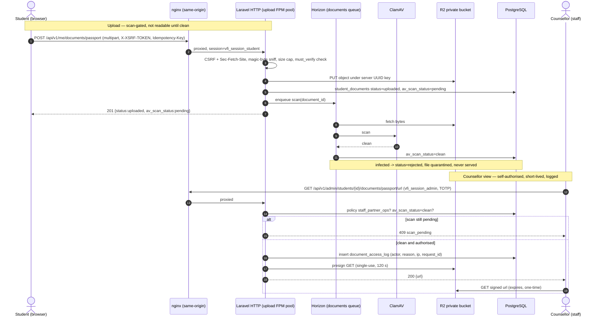

# 02 — Target architecture

What this is: the target backend architecture for VFI Overseas Education — components, request lifecycle, bounded contexts, how the vanilla-JS frontend talks to the API, storage/cache/queue/mail/search, and the deployment topology. For the engineers and AI agents building the backend. Sibling docs: [API contract](04-api-contract.md), [Data model](03-data-model.md), the frontend orientation in [../memory.md](../memory.md).

> Stack is decided — do not re-litigate. **PHP 8.3 · Laravel · Filament v4 · managed PostgreSQL 16 (PITR) · Sanctum cookie sessions · Redis · Cloudflare R2 · same-origin behind one nginx.** The `memory.md` "NestJS/Prisma" note is superseded by ADR-001.

---

## 1. Invariants — do not violate

| Rule | Why |
|---|---|
| **Frontend stays vanilla ES5, no build step, no npm, no CDN** | User requirement. The 52 pages open and run as static files. The backend is a *separate* service reached over HTTP. |
| **Same-origin topology** | One nginx serves static files at `/` and proxies `/api/*` to PHP-FPM. Sanctum cookie sessions + double-submit CSRF depend on it. A cross-registrable-domain split forces `SameSite=None; Secure` + credentialed CORS — out of scope for v1. |
| **No token in JS-reachable storage** | The frontend interpolates untrusted strings into `innerHTML` (`js/portal.js` `VFIToast`). A `localStorage` bearer token is one XSS away from theft. Sessions live in HttpOnly cookies. |
| **`js/store.js` keeps its ~30 exported names** | Reimplemented as an HTTP client with identical signatures; 52 pages migrate almost untouched. This is the highest-leverage seam in the project. |
| **Synchronous content accessors stay synchronous** | `VFI.list/settings/country/…` are called inline at boot by `render.js`. A per-page bundle is injected as `window.VFI_BOOTSTRAP` *before* `store.js`, so accessors read a pre-populated cache. Do not make them Promise-based. |
| **Empty means fall-through** | `""` / `[]` = "keep the page's built-in HTML". The API round-trips them faithfully; Laravel `ConvertEmptyStringsToNull` + `TrimStrings` are disabled on content routes. |
| **Managed Postgres with PITR, never on-box** | A money ledger + passport metadata on `pg_dump`-only backups is a data-loss incident waiting to happen. |
| **Migrations are a one-shot deploy job, never auto-migrate on boot** | Avoids the multi-replica race that takes the site down at deploy. |

---

## 2. Component diagram

```mermaid
graph TB
  subgraph Client["Browser — vanilla ES5, no build"]
    Pages["52 static HTML pages"]
    Api["js/api.js<br/>(CSRF header + credentials:include + 401 redirect)"]
    Store["js/store.js<br/>(HTTP client, ~30 legacy names)"]
    Boot["window.VFI_BOOTSTRAP<br/>(per-page content bundle)"]
    Pages --> Store --> Api
    Boot -.injected before store.js.-> Store
  end

  subgraph Edge["Cloudflare"]
    CDN["CDN cache<br/>(32 marketing pages + /media/*)"]
    Turnstile["Turnstile<br/>(bot check on public writes)"]
  end

  subgraph Box["Single VPS — Singapore/Mumbai"]
    Nginx["nginx<br/>same-origin: / static, /api → FPM, /admin → FPM"]
    subgraph FPM["PHP-FPM"]
      Web["Laravel HTTP<br/>(JSON API /api/v1/*)"]
      Filament["Filament v4 admin<br/>(/admin, server-rendered)"]
      UploadPool["separate FPM pool<br/>(uploads — never starves the site)"]
    end
    Horizon["Horizon workers<br/>queues: emails · documents · search · default"]
    Scheduler["Laravel scheduler<br/>retention · orphan sweep · KPI rollup · backup"]
    ClamAV["ClamAV sidecar"]
    Redis["Redis<br/>sessions · rate-limit/OTP · queue · bundle cache"]
  end

  subgraph Managed["Managed / external"]
    PG["PostgreSQL 16<br/>(managed, PITR) — relational + jsonb + FTS"]
    R2pub["R2 public bucket<br/>content-hashed images"]
    R2priv["R2 private bucket<br/>documents, UUID keys"]
    Mail["Postmark → SES<br/>(OTP, reset, notices)"]
    PSP["PSP / Flywire<br/>(signed webhooks)"]
  end

  Api -->|HTTPS same-origin| CDN --> Nginx
  Turnstile -.token.-> Api
  Nginx --> Web
  Nginx --> Filament
  Nginx --> UploadPool
  Web --> Redis
  Web --> PG
  Web -->|enqueue| Redis
  Horizon --> Redis
  Horizon --> PG
  Horizon --> ClamAV
  Horizon --> Mail
  UploadPool --> R2priv
  Web -->|presign GET| R2priv
  Web --> R2pub
  CDN --> R2pub
  PSP -->|POST /api/v1/webhooks/*| Nginx
  Filament --> PG
  Scheduler --> PG
```

---

## 3. Request lifecycle

### 3.1 Public marketing read (cacheable)

| Step | Actor | Detail |
|---|---|---|
| 1 | Browser | Loads a static HTML page; `window.VFI_BOOTSTRAP` is injected server-side (or fetched by `store.js` on first paint) via `GET /api/v1/content/bundle?page=<file>` |
| 2 | Cloudflare | Serves the bundle from CDN if warm (`ETag`, `max-age=60`, `stale-while-revalidate=300`); else forwards |
| 3 | nginx → FPM | Laravel reads the Redis-cached bundle or builds it from Postgres, emits `ETag` |
| 4 | `store.js` | Populates its internal `cache`; the synchronous `VFI.*` accessors return inline for `render.js` |
| 5 | Publish | An admin edit purges the affected page's CDN key and the Redis bundle |

No `Set-Cookie` on public GETs (keeps them CDN-cacheable). Images resolve to immutable content-hashed `/media/{id}.jpg` with a 1-year cache.

### 3.2 Authenticated write

| Step | Detail |
|---|---|
| 1 | Page boots, calls `GET /api/v1/auth/me`; on `401` it redirects to sign-in and renders nothing |
| 2 | `js/api.js` reads `XSRF-TOKEN` cookie, echoes it as `X-XSRF-TOKEN`, sends `credentials:"include"` |
| 3 | Middleware: TLS → rate-limit class (Redis) → CSRF double-submit + `Sec-Fetch-Site` → Sanctum session → RLS `SET LOCAL app.agency_id` → policy/gate |
| 4 | Controller executes inside a DB transaction where money/documents are touched; long work (AV scan, email) is enqueued, not done inline |
| 5 | Response: single error envelope on failure, `X-Request-Id` on every response, `Cache-Control: no-store` on authed responses |

### 3.3 Tenancy enforcement (partner)

The acting `partner_agency_id` comes **only** from the session, never a path/query/body param. Enforced twice: Eloquent `BelongsToAgency` global scope, and Postgres Row-Level Security as an independent net. A missed predicate returns zero rows / `404`, never another agency's data. A CI test fails the build if any partner-scoped table is queried without a tenant predicate.

---

## 4. Bounded contexts / modules

| Context | Owns | Frontend surface | Notes |
|---|---|---|---|
| **Identity** | users, roles, sessions, OTP flows, reset tokens, admin invites, auth_events | `js/auth.js`, `js/partner-auth.js`, admin login | Unified OTP keyed by opaque `flow_id`; three cookie scopes |
| **Content / CMS** | 10 collections + 5 override singletons + media map + page map, audit log, backups | `js/render.js`, `js/store.js`, Filament | Empty-fall-through + order-is-the-array preserved |
| **Students** | profile, addresses, qualifications, tests, prefs, documents, tracking | `js/student-portal.js` | Implicit-self endpoints; no id in path |
| **Partners / tenancy** | agencies (the tenant), members/seats, applications-to-register, referral links, console content | `js/portal.js`, `js/portal-render.js` | RLS + global scope; greeting from session, not the global `partnerName` |
| **Applications** | applications, status events, KPI rollups | `partner-applications.html` (greenfield) | KPIs computed server-side, tenant-scoped |
| **Documents** | student docs, enquiry docs, files, access log, disclosures | student profile + partner enquiry modal | Scan-gated private storage; the highest-sensitivity path |
| **Wallet / money** | wallets, ledger, top-ups, fee charges, webhooks, Flywire | `partner-wallet.html` | Append-only ledger; credit only via signed webhook |
| **Search** | institutions, programs, intakes, requirements, labels, flat search table | `partner-search.html` | Postgres-first; no live per-facet counts in v1 |
| **Public writes** | contact enquiries, newsletter, QR self-registration | `contact.html`, QR landing | Turnstile + rate limits |
| **Platform** | email send, rate-limit counters, audit, retention/GDPR jobs | — | Cross-cutting; runs on Horizon + scheduler |

Each context carries its own auth/tenancy/audit/rate-limit/upload work. Nothing is deferred to a terminal "security phase".

---

## 5. Frontend ↔ API contract

### 5.1 The seam

`js/store.js` becomes an HTTP client keeping every exported name (`list/get/put/remove/settings/media/country/region/servicesPage/partnerPage/partnerPortal/pageEnabled/getImage/uploadImage/exportAll/importAll/uid/fmtDate/esc/…`). A new ~60-line ES5 `js/api.js` loads before `store.js` on every page and centralises the API base, `credentials:"include"`, the CSRF header, and the `401` redirect.

```js
// js/api.js — ES5, no build step, no template literals. Loaded before store.js.
window.VFIApi = (function () {
  var BASE = "/api/v1";
  function cookie(name) {
    var m = document.cookie.match(new RegExp("(^|; )" + name + "=([^;]*)"));
    return m ? decodeURIComponent(m[2]) : "";
  }
  function req(method, path, body, isForm) {
    var opts = { method: method, credentials: "include", headers: {} };
    if (method !== "GET" && method !== "HEAD") {
      opts.headers["X-XSRF-TOKEN"] = cookie("XSRF-TOKEN");
    }
    if (body != null) {
      if (isForm) { opts.body = body; }
      else { opts.headers["Content-Type"] = "application/json";
             opts.body = JSON.stringify(body); }
    }
    return fetch(BASE + path, opts).then(function (r) {
      if (r.status === 204) return { status: 204, data: null };
      return r.json().then(function (j) {
        if (r.status === 401 && window.VFIApi._on401) window.VFIApi._on401(path);
        return { status: r.status, data: j };
      });
    });
  }
  return {
    get:  function (p) { return req("GET", p, null, false); },
    post: function (p, b) { return req("POST", p, b, false); },
    put:  function (p, b) { return req("PUT", p, b, false); },
    del:  function (p) { return req("DELETE", p, null, false); },
    upload: function (p, fd) { return req("POST", p, fd, true); },
    _on401: null
  };
})();
```

### 5.2 Tokens & sessions

Sanctum SPA/cookie mode. No JWT, no refresh endpoint — sliding idle + absolute expiry; on expiry the server returns `401` and the page redirects.

| Cookie | Scope path | Flags | Lifetime |
|---|---|---|---|
| `vfi_session_student` | `/api/v1` | `HttpOnly; Secure; SameSite=Lax` | idle 30 m / 7 d remember; absolute 12 h / 7 d |
| `vfi_session_partner` | `/api/v1` | `HttpOnly; Secure; SameSite=Lax` | idle 30 m / 7 d remember; absolute 12 h / 7 d |
| `vfi_session_admin` | `/api/v1/admin` | `HttpOnly; Secure; SameSite=Strict` | idle **15 m**; absolute 8 h; mandatory TOTP |
| `XSRF-TOKEN` | `/` | `Secure; SameSite=Lax` (JS-readable — by design) | session |

Three named/scoped cookies mean a student session can never act on partner/admin routes. See [API contract §1.2–1.3](04-api-contract.md) for the full token + CSRF stance.

### 5.3 CORS

Same-origin ⇒ CORS effectively off. If a split is ever forced: exact origin allow-list (never `*` with credentials), `Allow-Credentials: true`, explicit method/header allow-list, `Vary: Origin`, preflight cached 10 min.

---

## 6. Object storage — documents & images

Two Cloudflare R2 buckets, S3-compatible, zero egress.

| Bucket | Contents | Access | Cache |
|---|---|---|---|
| **public** | admin-uploaded marketing images (canvas-downscaled, EXIF stripped, JPEG) | content-hashed immutable URL via CDN | 1 year |
| **private** | passport scans, transcripts, bank statements, visa forms, enquiry academic docs | server-generated UUID key; **never** the client filename; per-request presigned GET 60–300 s, single-use | none |

Upload pipeline (v1): browser → API → magic-byte sniff → size cap (15 MB) → **ClamAV scan-gate on the `documents` queue** → private R2 → row `av_scan_status: pending`. A file is **not readable** until `av_scan_status: clean`; a still-pending fetch returns `409 scan_pending`, an infected one `422 file_rejected`. Every presigned URL mint is written to `document_access_log`. Presigned direct-to-R2 upload is a v2 optimisation, still scan-gated.

`getImage()` keeps its dual-mode contract: an id containing `/`, matching `^https?:`, or ending in an image extension resolves to itself (bundled `assets/img/*.jpg` seed defaults keep working); a generated `img_*` id resolves to R2. One-function change in `store.js`.

---

## 7. Cache, queue, email, search

| Concern | Choice | Detail |
|---|---|---|
| **Cache** | Redis + Cloudflare | Redis holds sessions, rate-limit/OTP counters, the ETag'd content bundle; Cloudflare fronts the 32 read-heavy pages and `/media/*` |
| **Queue** | Redis + Horizon (systemd) | Four named queues — `emails`, `documents`, `search`, `default` — so an AV scan never delays an OTP |
| **Scheduler** | Laravel scheduler | retention deletion, orphan-image sweep, KPI rollups, nightly encrypted backup snapshot |
| **Email** | Postmark → SES | OTP, reset links, partner approval notices, console email-updates; SPF+DKIM+DMARC on a dedicated subdomain; bounce/complaint webhooks feed suppression + rate limits |
| **Search** | PostgreSQL-first | Denormalised flat `program_search` table (~300–600k rows): GIN `tsvector` free text, `pg_trgm` typeahead, ~30 requirement/label flags packed into a `smallint[]` with GIN `@>`/`&&`, composite b-trees on high-selectivity scalars, keyset pagination. Rebuild-and-swap on ingest. Typesense only if the client later demands live per-facet counts (documented exit). |

---

## 8. Sensitive flow — passport upload then counsellor view



Key properties: the file is never served from a public path; the client filename never becomes a storage path (no traversal); every read is logged with actor + reason + `X-Request-Id`; the signed URL is single-use and short-lived; staff cross-tenant read is a distinct role with its own access-log entries.

---

## 9. Deployment topology

| Layer | Choice |
|---|---|
| Edge | Cloudflare (CDN + Turnstile, free tier) |
| Host | One 4 GB VPS, Singapore or Mumbai (Dhaka latency), Docker Compose provisioned by Laravel Forge |
| On-box | nginx · PHP-FPM (with a **separate pool for uploads**) · Redis · Horizon (systemd) · ClamAV sidecar |
| Database | Managed PostgreSQL 16 with PITR (off-box) |
| Storage | Cloudflare R2 — two buckets (public CDN images, private documents) + a backup-snapshot prefix |
| Mail | Postmark (MVP) → SES |
| CI/CD | GitHub Actions: install → PHPStan/Larastan → Pint → tests → gitleaks + CVE + license gates → Docker build → cosign sign → SBOM. Deploy = `docker compose pull && up -d` + cosign verify gate; **migrations run as a one-shot deploy job with an advisory lock**. |
| Admin | Filament at `/admin`, behind login + mandatory TOTP, 15-min idle, off the public root |

Cookie/CSRF design assumes same-origin; keep the static site and API on the same registrable domain.

---

## 10. Non-functional targets

| Target | Value |
|---|---|
| Public page bundle (CDN warm) | p95 < 100 ms |
| Public bundle (origin build) | p95 < 300 ms |
| Authed read (`/auth/me`, profile, KPIs) | p95 < 400 ms |
| Program search, 40 facets, real catalogue | **p95 < 400 ms** (measured in staging; gate) |
| Document upload accept (pre-scan) | p95 < 2 s for a 5 MB scan on Dhaka mobile |
| AV scan turnaround | p95 < 60 s (async; UI shows pending) |
| Email/OTP delivery | p95 < 30 s; valid DKIM |
| Availability | 99.5% app; DB PITR RPO ≤ 5 min, restore-drill RTO measured |
| Backups | nightly encrypted snapshot + PITR; restore drill each release |
| Money correctness | append-only ledger; `balance == SUM(signed ledger)` reconciliation passes nightly and under concurrent load |
| Tenancy | zero cross-tenant reads; CI fails on any untenanted partner query; RLS returns zero rows if the app scope is stripped |
| Security posture | TLS + HSTS preload; `Cache-Control: no-store` on authed responses; secrets in a manager, not `.env` in repo; unsigned image cannot deploy |
| Rate limits | enforced server-side in Redis, independent of the cosmetic client cooldowns (see [API contract §1.12](04-api-contract.md)) |
| Retention / GDPR | per-document retention clock + deletion job; subject export; erasure with legal-hold exception; record of onward disclosure |

---

## 11. Build order (mirrors the roadmap)

| Phase | Lands |
|---|---|
| P0 | Platform: repo, CI, containers, managed PG + Redis + R2, `store.js` HTTP-client skeleton + `js/api.js` |
| P1 | Identity spine + **admin auth + mandatory TOTP** (closes the top gap) + tenancy machinery + CI tenancy guard |
| P2 | Public content read via `/content/bundle` + **contact-form persistence** (stops dropping leads) |
| P3 | Filament CMS write path: CRUD, reorder, media pipeline, page toggles, backup, audit |
| P4 | Student auth — the `js/auth.js` markers + the missing `student-reset.html` |
| P5 | Student portal — profile + scan-gated document packs + tracking |
| P6 | Partner identity + tenancy proof + the `js/partner-auth.js` markers + `vfi-partner-reset.html` |
| P7 | Partner console core — students, applications pipeline, enquiries, QR — the `portal.js:430` marker split |
| P8 | Program search + ingest |
| P9 | Wallet/money + staff back-office + GDPR ops + production cutover |

See [API contract](04-api-contract.md) for the endpoint surface and the REAL REQUEST marker map.
