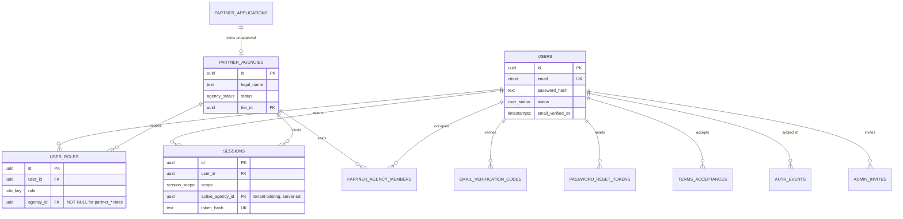
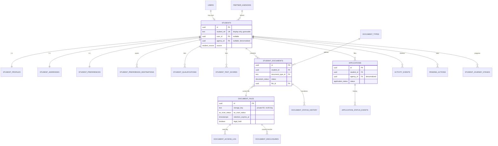
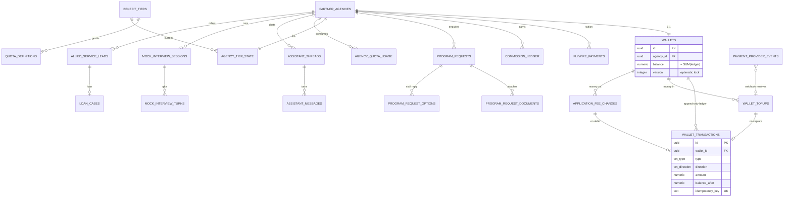
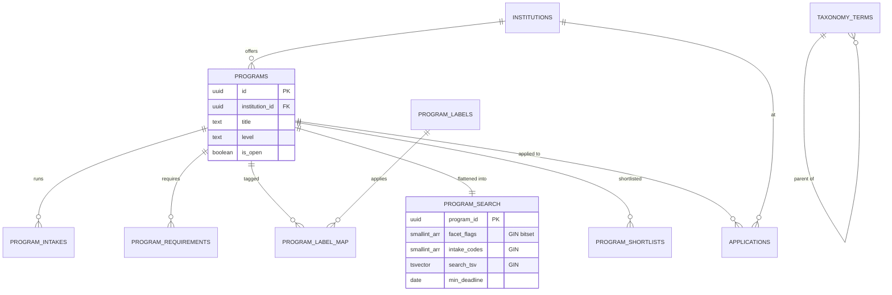
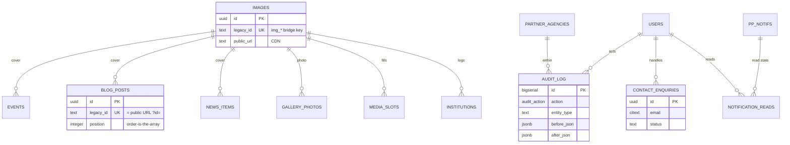

# VFI Overseas Education — Complete Data Model

**What this is:** the definitive PostgreSQL 16 schema for the VFI backend — every table, column, type, constraint, index, the tenancy net, enum strategy, soft-delete/audit conventions, data classification (encryption + retention), and the step-by-step cutover from the current browser `localStorage`/`IndexedDB` store. **Who it is for:** the engineers and AI agents building the Laravel backend and wiring the 52 static pages to it. Read it before writing a migration.

**Related docs:** [agent orientation](../memory.md) · [backend development plan](BACKEND_DEVELOPMENT_PLAN.md) · [paused-task notes](BACKEND-TASK-PAUSED.md). The frontend store this replaces is `js/store.js`; the admin editor over it is `js/admin.js`.

**Stack (fixed, do not re-litigate):** PHP 8.3 + Laravel + Filament v4 + **managed PostgreSQL 16 (PITR)**. Same-origin, Sanctum cookie sessions. Cloudflare R2 for blobs. Redis for sessions/rate-limits/queues.

> Convention markers: **[A]** = an explicit assumption; **[SEED]** = shape taken verbatim from `js/store.js` SEED; **[NEW]** = does not exist in the front end today.
>
> Note: the older `memory.md` "Backend development plan" names NestJS/Prisma/22 tables. That plan is **superseded** by the accepted ADR (Laravel/Postgres) and by this document. Where the two disagree, this document wins.

---

## Contents

| § | Section |
|---|---|
| — | [ERD (mermaid)](#erd) |
| 0 | [Global conventions](#0-global-conventions) |
| 1 | [Enum / lookup strategy](#1-enum--lookup-strategy) |
| 2 | [Identity, authentication & sessions](#2-identity-authentication--sessions) |
| 3 | [Tenancy — three independent nets](#3-tenancy-strategy--three-independent-nets) |
| 4 | [Public marketing CMS](#4-public-marketing-cms-from-jsstorejs-seed) |
| 5 | [Media / images](#5-media--images) |
| 6 | [Student domain](#6-student-domain) |
| 7 | [Partner console](#7-partner-agency-console) |
| 8 | [Soft-delete, audit & contact leads](#8-soft-delete-audit--contact-leads) |
| 9 | [Data classification & encryption](#9-data-classification--encryption) |
| 10 | [Retention rules](#10-retention-rules-sensitive-documents) |
| 11 | [Migration path (localStorage → Postgres)](#11-migration-path--localstorageindexeddb--postgresql) |
| 12 | [Build-order note](#12-build-order-note-schema-is-delivered-in-this-sequence) |

---

## ERD

Five domain diagrams instead of one unreadable 70-table graph. Attributes are trimmed to PK/FK + a couple of load-bearing columns; full columns are in the DDL below. Crow's-foot: `||--o{` = one-to-many, `||--||` = one-to-one, `}o--||` = many-to-one.

### E1 — Identity, tenancy & sessions



### E2 — Student domain



### E3 — Partner console & money



### E4 — Programs & search



### E5 — Public CMS, media & audit



---

## 0. Global conventions

Apply to every table unless noted.

| Rule | Decision |
|---|---|
| Naming | `snake_case`, plural table names, singular column names. Join tables `a_b`. |
| Primary key | `id uuid PRIMARY KEY DEFAULT gen_random_uuid()` (PG 16 built-in; no extension). **Exception:** `blog_posts`, `events`, `news_items` keep the **legacy string id** as a natural key column (`legacy_id`) because `blog-post.html?id=<id>` is a public URL — see §4. |
| Timestamps | Every table: `created_at timestamptz NOT NULL DEFAULT now()`, `updated_at timestamptz NOT NULL DEFAULT now()` (Laravel maintains `updated_at`; a trigger backs it, §8.3). |
| Actor columns | Mutable business tables carry `created_by uuid NULL REFERENCES users(id)`, `updated_by uuid NULL REFERENCES users(id)`. Null = system/anonymous/seed. |
| Soft delete | Business tables carry `deleted_at timestamptz NULL`. Laravel `SoftDeletes`. **Ledger, audit, access-log, webhook tables are append-only and have NO `deleted_at`.** |
| Money | `numeric(20,4)` for amounts (exact; ADR mandates NUMERIC on wallet paths) + `currency char(3)` ISO-4217. Never `float`. |
| Dates | Calendar dates that render to users (event date, blog date, intake) are **`date`**, never `timestamptz` — a UTC timestamp renders 2026-09-02 as 01 Sep for a Dhaka (UTC+6) viewer. Instants (audit, sessions) are `timestamptz`. |
| Empty-string contract | Content override columns are `text NOT NULL DEFAULT ''` (or `jsonb NOT NULL DEFAULT '{}'`). `''`/`[]`/`{}` means "keep the page's built-in HTML". The API must round-trip empty faithfully. **Disable Laravel `ConvertEmptyStringsToNull` + `TrimStrings` on content routes.** |
| Ordering | Every collection and override-list gets an explicit `position integer NOT NULL`. New rows default to the **front** (lowest position) to preserve the current `unshift` home-page behaviour (§4.1). |
| Booleans | `boolean NOT NULL DEFAULT ...`; page-visibility uses the "absent = ON" rule via a default. |
| Encryption | Column-level encryption (Laravel `encrypted` cast, AES-256-GCM) on the columns flagged **enc** in §9. DB-at-rest encryption (managed PG) covers everything else. |

```sql
-- Run once, first migration:
CREATE EXTENSION IF NOT EXISTS pg_trgm;      -- typeahead on program search
CREATE EXTENSION IF NOT EXISTS btree_gin;    -- combine scalar + array in one GIN
CREATE EXTENSION IF NOT EXISTS citext;       -- case-insensitive unique email
-- gen_random_uuid() is built in on PG 16; no pgcrypto needed for UUIDs.

-- Shared updated_at trigger
CREATE OR REPLACE FUNCTION set_updated_at() RETURNS trigger AS $$
BEGIN NEW.updated_at = now(); RETURN NEW; END; $$ LANGUAGE plpgsql;
-- Attach per table: CREATE TRIGGER trg_updated BEFORE UPDATE ON <t>
--   FOR EACH ROW EXECUTE FUNCTION set_updated_at();
```

---

## 1. Enum / lookup strategy

Two mechanisms, chosen per-vocabulary by how the values behave.

| Mechanism | Use when | Cost |
|---|---|---|
| **Native PG `ENUM` type** | Vocabulary is **stable and append-only** (statuses, roles, packs). Mirrors a PHP 8.3 native enum 1:1. `ALTER TYPE ... ADD VALUE` is cheap; removal/reorder is hard — acceptable because these never shrink. | Migrations must add values in a non-transactional step. |
| **Lookup table** (`*_types`, `taxonomy_terms`) | Vocabulary is **admin/business-editable, ordered, or carries metadata** (program levels, study areas, countries, document definitions, benefit tiers). | A join, but Filament-editable without a deploy. |

**Never** store presentation (label/colour/icon) in the enum — the API returns the enum value, the client maps to label/chip (the front end already does this via `DOC_STATUS`, `APP_STATUS`, etc.).

### 1.1 Native enum types (DDL)

```sql
-- Identity / auth
CREATE TYPE user_status        AS ENUM ('pending_verification','active','suspended','locked','closed');
CREATE TYPE role_key           AS ENUM ('student','partner_owner','partner_counsellor',
                                        'staff_counsellor','staff_partner_ops','staff_finance',
                                        'content_editor','superadmin');
CREATE TYPE otp_purpose        AS ENUM ('signup_student','signup_partner','email_change');
CREATE TYPE session_scope      AS ENUM ('student','partner','admin');

-- Partner agency lifecycle
CREATE TYPE agency_status      AS ENUM ('pending_review','approved','rejected','suspended','closed');
CREATE TYPE agency_seat_role   AS ENUM ('owner','counsellor','finance_viewer');
CREATE TYPE partner_app_review AS ENUM ('pending','approved','rejected','more_info');

-- Student domain
CREATE TYPE student_source     AS ENUM ('self_signup','partner_modal','qr_link','admin');
CREATE TYPE document_pack      AS ENUM ('application','visa','enquiry','loan','interview');
CREATE TYPE document_status    AS ENUM ('missing','uploaded','verified','rejected'); -- 'rejected' is NEW (gap fix)
CREATE TYPE av_scan_status     AS ENUM ('pending','clean','infected','error');
CREATE TYPE journey_state      AS ENUM ('todo','now','done');
CREATE TYPE activity_tone      AS ENUM ('ok','info','wait','part','bad');

-- Applications
CREATE TYPE application_status AS ENUM ('submitted','review','conditional','offer',
                                        'payment','visa_received','visa_rejected',
                                        'non_enrolment','deferral','rejected','enrolled');

-- Money
CREATE TYPE wallet_status      AS ENUM ('active','frozen');
CREATE TYPE txn_type           AS ENUM ('topup','application_fee','refund','adjustment','commission_credit');
CREATE TYPE txn_direction      AS ENUM ('credit','debit');
CREATE TYPE txn_status         AS ENUM ('pending','settled','failed','reversed');
CREATE TYPE payment_provider   AS ENUM ('bkash','nagad','sslcommerz','card','flywire','manual');
CREATE TYPE psp_intent_status  AS ENUM ('created','authorised','captured','failed','expired');

-- Enquiries / requests
CREATE TYPE program_req_type   AS ENUM ('new','existing'); -- student-not-in-VFI / in-VFI
CREATE TYPE program_req_status AS ENUM ('new','in_progress','options_sent','closed');
CREATE TYPE enquiry_channel    AS ENUM ('console','whatsapp');

-- Console / AI
CREATE TYPE quota_code         AS ENUM ('assistant_messages','counsellor_seats','student_autofills','ai_mock_interviews');
CREATE TYPE quota_period       AS ENUM ('month','year','concurrent');
CREATE TYPE interview_status   AS ENUM ('created','in_progress','completed','abandoned');

-- Audit / classification
CREATE TYPE audit_action       AS ENUM ('create','update','delete','soft_delete','restore',
                                        'reorder','import','reset','toggle_page','login','logout',
                                        'role_grant','role_revoke','export','verify','reject',
                                        'topup','debit','refund','adjust','approve','suspend');
CREATE TYPE data_class         AS ENUM ('public','internal','personal','sensitive_personal','financial');
```

### 1.2 Lookup tables (business-editable vocabularies)

```sql
CREATE TABLE taxonomy_terms (
  id          uuid PRIMARY KEY DEFAULT gen_random_uuid(),
  vocabulary  text NOT NULL,          -- 'program_level','study_area','discipline_area','duration_band',
                                      -- 'country','province_state','intake_month','education_level','nationality'
  code        text NOT NULL,          -- stable machine code, e.g. 'pg','uk','sep'
  label       text NOT NULL,          -- display, e.g. 'Postgraduate'
  parent_id   uuid NULL REFERENCES taxonomy_terms(id),  -- province_state -> country
  sort_order  integer NOT NULL DEFAULT 0,
  active      boolean NOT NULL DEFAULT true,
  created_at  timestamptz NOT NULL DEFAULT now(),
  updated_at  timestamptz NOT NULL DEFAULT now(),
  UNIQUE (vocabulary, code)
);
CREATE INDEX ix_taxonomy_vocab ON taxonomy_terms (vocabulary, active, sort_order);
```

| Index | Serves |
|---|---|
| `UNIQUE (vocabulary, code)` | Idempotent taxonomy upserts; stable machine codes referenced by FKs-in-spirit across programs/students. |
| `ix_taxonomy_vocab` | "give me the active `country` options ordered" — the served dropdown lists. |

**Rationale:** the country/level/study-area lists are duplicated in **five** places today (`partner-search.html`, `js/portal.js COUNTRIES/DESTS`, `partner-students.html`, `partner-interview.html`, `partner-dashboard.html`) and already disagree (Learning Resources lists Switzerland/Singapore/UAE and omits the USA). One served vocabulary reconciles them. The public site's 6 `study-in-*` slugs, the student portal's 7 destination checkboxes, and the partner modal's 8 `DESTS` all resolve here.

---

## 2. Identity, authentication & sessions

One `users` table behind all human actors → one password/lockout/OTP pipeline. Roles are a join; tenant-bound roles carry `agency_id`.

```sql
CREATE TABLE users (
  id                    uuid PRIMARY KEY DEFAULT gen_random_uuid(),
  email                 citext NOT NULL,                 -- citext = case-insensitive unique
  password_hash         text NULL,                       -- argon2id; NULL until set (invite/QR-created)
  password_updated_at   timestamptz NULL,
  status                user_status NOT NULL DEFAULT 'pending_verification',
  email_verified_at     timestamptz NULL,
  failed_login_count    integer NOT NULL DEFAULT 0,
  locked_until          timestamptz NULL,
  mfa_totp_secret       text NULL,                       -- enc; staff/admin only
  mfa_enrolled_at       timestamptz NULL,
  last_login_at         timestamptz NULL,
  last_login_ip         inet NULL,
  created_at            timestamptz NOT NULL DEFAULT now(),
  updated_at            timestamptz NOT NULL DEFAULT now(),
  deleted_at            timestamptz NULL
);
-- Partial unique guarantees only ONE live account per email (soft-deleted rows can recycle it):
CREATE UNIQUE INDEX uq_users_email_live ON users (email) WHERE deleted_at IS NULL;

CREATE TABLE user_roles (
  id            uuid PRIMARY KEY DEFAULT gen_random_uuid(),
  user_id       uuid NOT NULL REFERENCES users(id) ON DELETE CASCADE,
  role          role_key NOT NULL,
  agency_id     uuid NULL REFERENCES partner_agencies(id) ON DELETE CASCADE,
  granted_by    uuid NULL REFERENCES users(id),
  granted_at    timestamptz NOT NULL DEFAULT now(),
  revoked_at    timestamptz NULL,
  -- partner_* roles MUST carry an agency; all others MUST NOT:
  CONSTRAINT ck_role_agency CHECK (
    (role IN ('partner_owner','partner_counsellor') AND agency_id IS NOT NULL)
    OR (role NOT IN ('partner_owner','partner_counsellor') AND agency_id IS NULL)
  )
);
CREATE UNIQUE INDEX uq_user_role_live ON user_roles
  (user_id, role, COALESCE(agency_id,'00000000-0000-0000-0000-000000000000'))
  WHERE revoked_at IS NULL;
CREATE INDEX ix_user_roles_user ON user_roles (user_id) WHERE revoked_at IS NULL;

CREATE TABLE sessions (                          -- Sanctum-backed; opaque server session
  id                    uuid PRIMARY KEY DEFAULT gen_random_uuid(),
  user_id               uuid NOT NULL REFERENCES users(id) ON DELETE CASCADE,
  scope                 session_scope NOT NULL,          -- student|partner|admin cookie scope
  active_role           role_key NOT NULL,
  active_agency_id      uuid NULL REFERENCES partner_agencies(id),  -- tenant binding; from server ONLY
  token_hash            text NOT NULL,                   -- sha256 of the session/refresh token
  remember_me           boolean NOT NULL DEFAULT false,
  issued_at             timestamptz NOT NULL DEFAULT now(),
  last_seen_at          timestamptz NOT NULL DEFAULT now(),
  idle_expires_at       timestamptz NOT NULL,
  absolute_expires_at   timestamptz NOT NULL,
  revoked_at            timestamptz NULL,
  revoked_reason        text NULL,                       -- logout|password_reset|role_change|agency_suspended|admin_revoke|reuse_detected
  ip                    inet NULL,
  user_agent            text NULL
);
CREATE INDEX ix_sessions_user_live ON sessions (user_id) WHERE revoked_at IS NULL;
CREATE UNIQUE INDEX uq_sessions_token ON sessions (token_hash);

CREATE TABLE email_verification_codes (          -- 6-digit OTP; keyed on opaque flow_id, NOT ?email=
  id            uuid PRIMARY KEY DEFAULT gen_random_uuid(),
  flow_id       text NOT NULL,                    -- opaque token replacing ?email= in the URL
  user_id       uuid NULL REFERENCES users(id),
  email         citext NOT NULL,                  -- address the code was sent to
  code_hash     text NOT NULL,                    -- never plaintext
  purpose       otp_purpose NOT NULL,
  created_at    timestamptz NOT NULL DEFAULT now(),
  expires_at    timestamptz NOT NULL,             -- created_at + 10 min (UI promises 10 min)
  attempts_used smallint NOT NULL DEFAULT 0,
  max_attempts  smallint NOT NULL DEFAULT 5,
  sends_in_window smallint NOT NULL DEFAULT 1,
  last_sent_at  timestamptz NOT NULL DEFAULT now(),
  consumed_at   timestamptz NULL,
  request_ip    inet NULL
);
CREATE UNIQUE INDEX uq_otp_flow ON email_verification_codes (flow_id);
CREATE INDEX ix_otp_email_open ON email_verification_codes (email) WHERE consumed_at IS NULL;

CREATE TABLE password_reset_tokens (             -- consuming landing page is NEW (student-reset / partner-reset)
  id                uuid PRIMARY KEY DEFAULT gen_random_uuid(),
  user_id           uuid NOT NULL REFERENCES users(id) ON DELETE CASCADE,
  token_hash        text NOT NULL,               -- 32 CSPRNG bytes hashed
  requested_for     citext NOT NULL,
  created_at        timestamptz NOT NULL DEFAULT now(),
  expires_at        timestamptz NOT NULL,        -- +30-60 min
  consumed_at       timestamptz NULL,
  requested_ip      inet NULL,
  consumed_ip       inet NULL,
  invalidated_by    uuid NULL REFERENCES password_reset_tokens(id)  -- a newer request supersedes
);
CREATE UNIQUE INDEX uq_reset_token ON password_reset_tokens (token_hash);
CREATE INDEX ix_reset_user_open ON password_reset_tokens (user_id) WHERE consumed_at IS NULL;

CREATE TABLE terms_acceptances (
  id            uuid PRIMARY KEY DEFAULT gen_random_uuid(),
  user_id       uuid NOT NULL REFERENCES users(id) ON DELETE CASCADE,
  document      text NOT NULL,                   -- 'terms'|'privacy'|'partner_terms'|'payment_terms'
  version       text NOT NULL,
  document_hash text NULL,
  context       text NOT NULL,                   -- 'student_signup'|'partner_registration'
  accepted_at   timestamptz NOT NULL DEFAULT now(),
  accepted_ip   inet NULL,
  user_agent    text NULL
);
CREATE INDEX ix_terms_user ON terms_acceptances (user_id);

CREATE TABLE admin_invites (                     -- how staff accounts come to exist (no admin sign-up UI, ever)
  id            uuid PRIMARY KEY DEFAULT gen_random_uuid(),
  email         citext NOT NULL,
  role_to_grant role_key NOT NULL,
  invited_by    uuid NOT NULL REFERENCES users(id),
  token_hash    text NOT NULL,
  expires_at    timestamptz NOT NULL,
  consumed_at   timestamptz NULL,
  created_at    timestamptz NOT NULL DEFAULT now()
);
CREATE UNIQUE INDEX uq_admin_invite_token ON admin_invites (token_hash);

CREATE TABLE auth_events (                        -- append-only; feeds lockout + support + anomaly alerts
  id              bigserial PRIMARY KEY,
  event_type      text NOT NULL,                 -- signin_success|signin_fail|signup|otp_sent|otp_verified|
                                                 -- otp_failed|reset_requested|reset_consumed|logout|session_revoked|...
  actor_user_id   uuid NULL REFERENCES users(id),
  subject_user_id uuid NULL REFERENCES users(id),
  subject_agency_id uuid NULL REFERENCES partner_agencies(id),
  email_attempted citext NULL,                   -- the only trace an unknown-account attack leaves
  result          text NULL,
  failure_reason  text NULL,
  ip              inet NULL,
  user_agent      text NULL,
  request_id      text NULL,
  metadata        jsonb NOT NULL DEFAULT '{}',
  created_at      timestamptz NOT NULL DEFAULT now()
);
CREATE INDEX ix_auth_events_subject ON auth_events (subject_user_id, created_at DESC);
CREATE INDEX ix_auth_events_email   ON auth_events (email_attempted, created_at DESC);
CREATE INDEX ix_auth_events_type    ON auth_events (event_type, created_at DESC);
```

### Indexes — what each serves

| Index | Serves |
|---|---|
| `uq_users_email_live` | One live account per email; soft-deleted rows can recycle the address. |
| `uq_user_role_live` | Prevents a duplicate live grant of the same (user, role, agency); the `COALESCE` sentinel makes NULL agency comparable. |
| `ix_user_roles_user` | Boot-time "what can this user do" role resolution. |
| `ix_sessions_user_live` | "Sign out everywhere" and revoke-on-password-change: find live sessions for a user. |
| `uq_sessions_token` | Session lookup on every authenticated request (hash of the cookie). |
| `uq_otp_flow` | Verify/resend keyed on the opaque `flow_id` (replaces `?email=`). |
| `ix_otp_email_open` | Enforce "one live code per email"; invalidate the prior on resend. |
| `uq_reset_token` | Consume a reset token by its hash. |
| `ix_auth_events_email` | Failed-sign-in-by-attempted-email — the only trace an unknown-account attack leaves; feeds lockout/anomaly alerts. |

> **Rate-limit counters** (`otp_send`, `signin`, `verify`) live in **Redis**, not Postgres — TTL semantics fit Redis, and the client 30s cooldowns are cosmetic. Not modelled as a table.

---

## 3. Tenancy strategy — three independent nets

The #1 stated risk is one agency reading another's students/applications/wallet. Defence in depth:

**Net 1 — Eloquent global scope (`BelongsToAgency` trait).** Every partner-scoped model applies `WHERE agency_id = :session_agency`. The agency id comes **only** from `sessions.active_agency_id`. No endpoint accepts `?agencyId=`.

**Net 2 — PostgreSQL Row-Level Security (RLS).** A forgotten `WHERE` returns **zero rows**, not a competitor's book. Every request sets `SET LOCAL app.agency_id = '<uuid>'` at the start of the transaction (a middleware + a DB connection listener).

```sql
-- Applied to EVERY partner-scoped table (students, applications, student_documents,
-- wallets, wallet_transactions, program_requests, mock_interview_sessions,
-- notification_reads, allied_service_leads, qr_registration_links, ...):
ALTER TABLE students ENABLE ROW LEVEL SECURITY;
ALTER TABLE students FORCE ROW LEVEL SECURITY;   -- applies even to the table owner
CREATE POLICY tenant_isolation ON students
  USING       (agency_id = current_setting('app.agency_id', true)::uuid)
  WITH CHECK  (agency_id = current_setting('app.agency_id', true)::uuid);

-- Staff cross-tenant read (staff_counsellor / staff_partner_ops) runs under a
-- SEPARATE Postgres role that BYPASSES RLS, gated by a Laravel policy + a
-- reason-for-access prompt logged to document_access_log. Never the app role.
```

**Net 3 — CI guard.** A test fails the build if any query against a partner-scoped table is issued without a tenant predicate (static check + a runtime assertion in the test DB that `app.agency_id` is set). This test is a **hard gate** — it lands in the same migration that creates the first partner table and can never be waived.

**Denormalisation rule:** `agency_id` is carried directly on `students`, `applications`, `student_documents`, `wallet_transactions`, `program_requests`, `activity_events`, `pending_actions` etc. so scoping never needs a join and the RLS predicate is a single indexed column.

**Cookie scopes (Sanctum):** three cookies — `student`, `partner`, `admin` — so a signed-in student cannot reach partner/admin surfaces. Admin lives under `/api/admin/*` with 15-min idle + mandatory TOTP. Because the console pages (`partner-*.html`) and portal pages (`student-*.html`) are plain static files with **no** server guard, protection is entirely the API's job: each page calls `/api/me` (or `/api/session/me`) on load and, on 401, redirects and renders nothing.

---

## 4. Public marketing CMS (from `js/store.js` SEED)

### 4.1 Ordering & id contracts (load-bearing)

- `VFI.put()` **unshifts** → new items appear at the front → home featured trio is `events[0..2]`, featured blog is `blogs[0]`. **New rows get `position = (SELECT COALESCE(MIN(position),0) FROM t WHERE ...) - 1`** (or a periodic renumber). Reorder is a first-class operation (Filament reorderable table) writing `position`.
- **Blog / event / news ids are public URLs.** Keep the legacy string id verbatim in `legacy_id`; internal FKs use the uuid.

### 4.2 Collections (10 — one generic CRUD path)

```sql
-- SITE SETTINGS (singleton; 14 fields) -------------------------------------
CREATE TABLE site_settings (
  id            smallint PRIMARY KEY DEFAULT 1 CHECK (id = 1),   -- enforce singleton
  brand         text NOT NULL DEFAULT '',
  tagline       text NOT NULL DEFAULT '',
  about         text NOT NULL DEFAULT '',
  phone         text NOT NULL DEFAULT '',
  phone2        text NOT NULL DEFAULT '',
  email         text NOT NULL DEFAULT '',
  address       text NOT NULL DEFAULT '',
  address_short text NOT NULL DEFAULT '',
  hours         text NOT NULL DEFAULT '',
  facebook      text NOT NULL DEFAULT '',
  instagram     text NOT NULL DEFAULT '',
  linkedin      text NOT NULL DEFAULT '',
  x             text NOT NULL DEFAULT '',
  youtube       text NOT NULL DEFAULT '',
  updated_at    timestamptz NOT NULL DEFAULT now(),
  updated_by    uuid NULL REFERENCES users(id)
);

-- EVENTS -------------------------------------------------------------------
CREATE TABLE events (
  id          uuid PRIMARY KEY DEFAULT gen_random_uuid(),
  legacy_id   text NULL,                          -- 'e1'.. from SEED, preserved
  title       text NOT NULL,
  event_date  date NULL,                          -- 'YYYY-MM-DD' -> date (NOT timestamptz)
  time_label  text NOT NULL DEFAULT '',           -- free text '10:00 am - 5:00 pm'
  type        text NOT NULL DEFAULT '',           -- Spot Assessment|Webinar|Fair|Coaching|Admissions Day
  city        text NOT NULL DEFAULT '',
  description text NOT NULL DEFAULT '',
  color       char(1) NOT NULL DEFAULT 'a' CHECK (color IN ('a','b','c')),
  image_id    uuid NULL REFERENCES images(id),    -- OR a path-style ref, see §5
  image_ref   text NULL,                          -- path/URL imgId passthrough ('assets/img/x.jpg')
  position    integer NOT NULL DEFAULT 0,
  published   boolean NOT NULL DEFAULT true,       -- NEW: draft/publish (front end has none)
  created_at  timestamptz NOT NULL DEFAULT now(),
  updated_at  timestamptz NOT NULL DEFAULT now(),
  created_by  uuid NULL REFERENCES users(id),
  updated_by  uuid NULL REFERENCES users(id),
  deleted_at  timestamptz NULL
);
CREATE UNIQUE INDEX uq_events_legacy ON events (legacy_id) WHERE legacy_id IS NOT NULL;
CREATE INDEX ix_events_order ON events (position) WHERE deleted_at IS NULL AND published;

-- BLOG POSTS ---------------------------------------------------------------
CREATE TABLE blog_posts (
  id          uuid PRIMARY KEY DEFAULT gen_random_uuid(),
  legacy_id   text NOT NULL,                       -- 'b1'.. = the PUBLIC URL KEY, never regenerate
  title       text NOT NULL,
  category    text NOT NULL DEFAULT '',
  post_date   date NULL,
  excerpt     text NOT NULL DEFAULT '',
  body        text NOT NULL DEFAULT '',            -- PLAIN TEXT by contract: blank line=para, '## '=h2,
                                                   -- '- '=li, '> '=quote. HTML is escaped. Enforce server-side.
  author      text NOT NULL DEFAULT '',
  read_time   text NOT NULL DEFAULT '',            -- blank = word-count estimate (client)
  color       char(1) NOT NULL DEFAULT 'a' CHECK (color IN ('a','b','c')),
  image_id    uuid NULL REFERENCES images(id),
  image_ref   text NULL,
  position    integer NOT NULL DEFAULT 0,
  published   boolean NOT NULL DEFAULT true,
  created_at  timestamptz NOT NULL DEFAULT now(),
  updated_at  timestamptz NOT NULL DEFAULT now(),
  created_by  uuid NULL REFERENCES users(id),
  updated_by  uuid NULL REFERENCES users(id),
  deleted_at  timestamptz NULL
);
CREATE UNIQUE INDEX uq_blogs_legacy ON blog_posts (legacy_id);  -- the route key must be unique & stable
CREATE INDEX ix_blogs_order ON blog_posts (position) WHERE deleted_at IS NULL AND published;

-- NEWS ITEMS ---------------------------------------------------------------
CREATE TABLE news_items (
  id          uuid PRIMARY KEY DEFAULT gen_random_uuid(),
  legacy_id   text NULL,
  title       text NOT NULL,
  excerpt     text NOT NULL DEFAULT '',
  color       char(1) NOT NULL DEFAULT 'a' CHECK (color IN ('a','b')),  -- render.js honours a|b only
  image_id    uuid NULL REFERENCES images(id),
  image_ref   text NULL,
  position    integer NOT NULL DEFAULT 0,
  published   boolean NOT NULL DEFAULT true,
  created_at  timestamptz NOT NULL DEFAULT now(),
  updated_at  timestamptz NOT NULL DEFAULT now(),
  created_by  uuid NULL REFERENCES users(id), updated_by uuid NULL REFERENCES users(id),
  deleted_at  timestamptz NULL
);
CREATE INDEX ix_news_order ON news_items (position) WHERE deleted_at IS NULL AND published;

-- GALLERY PHOTOS (empty = a real "no photos" state, NOT fall-through) --------
CREATE TABLE gallery_photos (
  id            uuid PRIMARY KEY DEFAULT gen_random_uuid(),
  legacy_id     text NULL,
  title         text NOT NULL DEFAULT '',
  caption       text NOT NULL DEFAULT '',
  image_id      uuid NOT NULL REFERENCES images(id),   -- required
  consent_note  text NOT NULL DEFAULT '',              -- NEW: gallery = identifiable students/staff (personal data)
  consent_ref   text NULL,                             -- NEW: link to a consent record / takedown handle
  position      integer NOT NULL DEFAULT 0,
  created_at    timestamptz NOT NULL DEFAULT now(),
  updated_at    timestamptz NOT NULL DEFAULT now(),
  created_by    uuid NULL REFERENCES users(id), updated_by uuid NULL REFERENCES users(id),
  deleted_at    timestamptz NULL
);
CREATE INDEX ix_gallery_order ON gallery_photos (position) WHERE deleted_at IS NULL;
```

| Index | Serves |
|---|---|
| `uq_*_legacy` (events/blogs/news) | Idempotent importer upsert on legacy id; blog legacy id = the public `?id=` route, must stay unique. |
| `ix_events_order` / `ix_blogs_order` / `ix_news_order` | The ordered public list and the home featured slice (`ORDER BY position`), filtered to live + published in one partial index. |
| `ix_gallery_order` | Ordered gallery render (empty result is a real "no photos" state). |

The six **partner-console collections** (`pp_managers, pp_updates, pp_quicklinks, pp_docs, pp_emails, pp_notifs`) are modelled in §7.6 — they are admin-authored but consumed inside the authenticated console.

### 4.3 Override singletons — jsonb (schema-fluid, 5 objects)

The country/region/services/partner override objects change shape whenever the page markup changes. Store as `jsonb` in the same Postgres — the honest relational-vs-document answer.

```sql
-- COUNTRY PAGES (6 slugs). Text overrides + 4 override LISTS in jsonb --------
CREATE TABLE country_pages (
  slug          text PRIMARY KEY CHECK (slug IN ('usa','canada','ireland','australia','uk','newzealand')),
  hero_title    text NOT NULL DEFAULT '',
  hero_sub      text NOT NULL DEFAULT '',
  overview_lead text NOT NULL DEFAULT '',
  -- whole-list replace on save; each element carries its own position:
  universities  jsonb NOT NULL DEFAULT '[]',   -- [{position,name,loc,note1,note2}]
  scholarships  jsonb NOT NULL DEFAULT '[]',   -- [{position,tag,title,desc,amount}]
  salaries      jsonb NOT NULL DEFAULT '[]',   -- [{position,role,pay}]
  faqs          jsonb NOT NULL DEFAULT '[]',   -- [{position,q,a}]
  version       integer NOT NULL DEFAULT 0,    -- optimistic concurrency (whole-list save is lossy w/o it)
  updated_at    timestamptz NOT NULL DEFAULT now(),
  updated_by    uuid NULL REFERENCES users(id)
);

CREATE TABLE region_pages (                    -- europe, asia
  slug        text PRIMARY KEY CHECK (slug IN ('europe','asia')),
  hero_title  text NOT NULL DEFAULT '',
  hero_sub    text NOT NULL DEFAULT '',
  bands       jsonb NOT NULL DEFAULT '[]',     -- [{position,name,desc,facts,img1,img2,img3}]
  version     integer NOT NULL DEFAULT 0,
  updated_at  timestamptz NOT NULL DEFAULT now(), updated_by uuid NULL REFERENCES users(id)
);

CREATE TABLE services_page (
  id          smallint PRIMARY KEY DEFAULT 1 CHECK (id = 1),
  hero_title  text NOT NULL DEFAULT '',
  hero_sub    text NOT NULL DEFAULT '',
  blocks      jsonb NOT NULL DEFAULT '[]',     -- [{position,name,anchor,desc,offers,ctaLabel,ctaHref,img}]
  version     integer NOT NULL DEFAULT 0,
  updated_at  timestamptz NOT NULL DEFAULT now(), updated_by uuid NULL REFERENCES users(id)
);

CREATE TABLE partner_page (                    -- public vfi-partner.html
  id          smallint PRIMARY KEY DEFAULT 1 CHECK (id = 1),
  hero_title  text NOT NULL DEFAULT '', hero_text text NOT NULL DEFAULT '',
  hero_btn1   text NOT NULL DEFAULT '', hero_btn2 text NOT NULL DEFAULT '',
  app_title   text NOT NULL DEFAULT '', app_text  text NOT NULL DEFAULT '',
  feat_title  text NOT NULL DEFAULT '', feat_lead text NOT NULL DEFAULT '',
  cta_title   text NOT NULL DEFAULT '', cta_btn   text NOT NULL DEFAULT '',
  steps_title text NOT NULL DEFAULT '', test_title text NOT NULL DEFAULT '',
  jobs_title  text NOT NULL DEFAULT '', faq_title text NOT NULL DEFAULT '',
  features    jsonb NOT NULL DEFAULT '[]',     -- [{position,title,text,imgId}]
  steps       jsonb NOT NULL DEFAULT '[]',     -- [{position,title,desc}]
  testimonials jsonb NOT NULL DEFAULT '[]',    -- [{position,quote,name}]
  jobs        jsonb NOT NULL DEFAULT '[]',     -- [{position,title,location,type,dept}]
  faqs        jsonb NOT NULL DEFAULT '[]',     -- [{position,q,a}]
  version     integer NOT NULL DEFAULT 0,
  updated_at  timestamptz NOT NULL DEFAULT now(), updated_by uuid NULL REFERENCES users(id)
);

CREATE TABLE partner_console_text (            -- partnerPortal singleton (console wording)
  id           smallint PRIMARY KEY DEFAULT 1 CHECK (id = 1),
  partner_name text NOT NULL DEFAULT '',       -- DEMO ARTEFACT: global greeting; real greeting comes from session
  welcome      text NOT NULL DEFAULT '',
  tier_name    text NOT NULL DEFAULT '',
  benefits     text NOT NULL DEFAULT '',       -- newline-delimited -> <li>
  loan_text    text NOT NULL DEFAULT '',
  accom_text   text NOT NULL DEFAULT '',
  testprep_text text NOT NULL DEFAULT '',
  version      integer NOT NULL DEFAULT 0,
  updated_at   timestamptz NOT NULL DEFAULT now(), updated_by uuid NULL REFERENCES users(id)
);
```

> **URL-scheme guard (security):** `services_page.blocks[].ctaHref`, `pp_quicklinks.url`, `pp_docs.url` are written straight into `href`. A validator must restrict to `^(https?:|mailto:|/)` — a `javascript:` value executes on click. Enforced in the request layer for jsonb array elements (a DB CHECK cannot cheaply reach into a jsonb array), plus a DB `CHECK` on the flat `pp_quicklinks`/`pp_docs` tables (§7.6).
>
> **Concurrency:** whole-list saves (`universities`, `bands`, `blocks`, partner lists) overwrite an entire array from one form snapshot. With 2-4 editors this silently drops a colleague's rows. The `version` column is the optimistic-concurrency guard — a stale save is rejected, not clobbered.

### 4.4 Page visibility

```sql
CREATE TABLE page_visibility (
  page_key    text PRIMARY KEY,                 -- lowercased basename, e.g. 'study-in-uk.html'
  enabled     boolean NOT NULL DEFAULT true,    -- absent key = ON is handled in the app (default true)
  locked      boolean NOT NULL DEFAULT false,   -- 'Always on' (index.html, blog-post.html, the 4 auth sub-flows)
  changed_by  uuid NULL REFERENCES users(id),
  changed_at  timestamptz NOT NULL DEFAULT now()
);
```

> **This is a MENU-LEVEL toggle, not access control.** The HTML file is still served. If a page must truly be hidden, enforce a 404/410 at nginx/Cloudflare. Admin copy must say so. Toggling `login.html`/`vfi-partner-login.html` is a DoS lever → treat as a privileged, audited op; consider marking the two sign-in entries `locked`.

---

## 5. Media / images

Stops shipping base64. Two R2 buckets: **public** (content-hashed, immutable, CDN, 1-yr cache) and **private** (documents, §6/§7). `getImage()`'s dual-mode resolution must survive.

```sql
CREATE TABLE images (
  id            uuid PRIMARY KEY DEFAULT gen_random_uuid(),
  legacy_id     text NULL,                       -- 'img_...' from IndexedDB, preserved for FK remap
  storage_key   text NOT NULL,                   -- R2 object key (server-generated UUID key)
  public_url    text NOT NULL,                   -- content-hashed CDN URL -> what getImage() returns
  mime          text NOT NULL DEFAULT 'image/jpeg',
  width         integer NULL,
  height        integer NULL,
  byte_size     integer NULL,
  sha256        text NULL,
  created_at    timestamptz NOT NULL DEFAULT now(),
  created_by    uuid NULL REFERENCES users(id),
  deleted_at    timestamptz NULL
);
CREATE UNIQUE INDEX uq_images_legacy ON images (legacy_id) WHERE legacy_id IS NOT NULL;

-- MEDIA SLOTS: key -> image, for FIXED [data-media] slots baked into markup
CREATE TABLE media_slots (
  slot_key    text PRIMARY KEY,                  -- 'hero','collage1','partnerHero','country_uk_hero','svc_1',...
  image_id    uuid NULL REFERENCES images(id),
  updated_at  timestamptz NOT NULL DEFAULT now(),
  updated_by  uuid NULL REFERENCES users(id)
);
```

**Dual-mode resolution (preserve exactly):** an `image_ref`/imgId that contains `/`, starts `http(s):`, or ends in an image extension resolves to **itself** (that is how `assets/img/*.jpg` SEED defaults work). Only `img_*` ids resolve to `images.public_url`. Implement in the `store.js` HTTP-client `getImage()` and mirror server-side.

**Reference counting (bug fix):** today `remove()`/`setMedia()` delete `imgId` with no ref check, and SEED reuses `assets/img/city-uk.jpg` across rows. Before deleting an `images` row, check no `events/blog_posts/news_items/gallery_photos/media_slots/institutions` and no jsonb override references it. Path-style refs are never deleted (they are bundled static files). A scheduled **orphan sweep** covers repeater-row uploads (which currently leak on cancel).

---

## 6. Student domain

```sql
CREATE TABLE students (
  id                  uuid PRIMARY KEY DEFAULT gen_random_uuid(),
  student_ref         text NOT NULL,             -- 'VFI-2026-04871' display ref; guessable => NEVER an access key
  user_id             uuid NULL REFERENCES users(id),  -- nullable: partner/QR-created before an account exists
  agency_id           uuid NULL REFERENCES partner_agencies(id),  -- NULL = VFI direct; denormalised for RLS
  registered_by       uuid NULL REFERENCES users(id),
  source              student_source NOT NULL DEFAULT 'self_signup',
  first_name          text NOT NULL DEFAULT '',
  middle_name         text NOT NULL DEFAULT '',
  last_name           text NOT NULL DEFAULT '',
  dob                 date NULL,
  nationality         text NOT NULL DEFAULT '',  -- taxonomy code (Bangladeshi, Nepali, ...)
  phone_cc            text NOT NULL DEFAULT '',  -- '+880'
  phone_national      text NOT NULL DEFAULT '',
  email               citext NULL,
  branch_label        text NOT NULL DEFAULT '',  -- 'Gulshan branch, Dhaka'
  counsellor_user_id  uuid NULL REFERENCES users(id),
  status              text NOT NULL DEFAULT 'active' CHECK (status IN ('active','archived')),
  archived_at         timestamptz NULL,
  created_at          timestamptz NOT NULL DEFAULT now(),
  updated_at          timestamptz NOT NULL DEFAULT now(),
  created_by          uuid NULL REFERENCES users(id), updated_by uuid NULL REFERENCES users(id),
  deleted_at          timestamptz NULL
);
CREATE UNIQUE INDEX uq_student_ref ON students (student_ref);
CREATE INDEX ix_students_agency ON students (agency_id) WHERE deleted_at IS NULL;
CREATE INDEX ix_students_user   ON students (user_id);
-- Dedup/claim rule (NEW): unique live email per agency; cross-agency same email => refuse/claim flow (app logic)
CREATE UNIQUE INDEX uq_student_email_agency ON students (agency_id, email)
  WHERE deleted_at IS NULL AND email IS NOT NULL;

-- Profile cards (1:1) ------------------------------------------------------
CREATE TABLE student_profiles (
  student_id      uuid PRIMARY KEY REFERENCES students(id) ON DELETE CASCADE,
  first_name      text NOT NULL DEFAULT '', middle_name text NOT NULL DEFAULT '', last_name text NOT NULL DEFAULT '',
  dob             date NULL,
  nationality     text NOT NULL DEFAULT '',
  phone_cc        text NOT NULL DEFAULT '', phone_national text NOT NULL DEFAULT '',
  email           citext NULL,
  updated_at      timestamptz NOT NULL DEFAULT now(), version integer NOT NULL DEFAULT 0
);
CREATE TABLE student_addresses (
  student_id  uuid PRIMARY KEY REFERENCES students(id) ON DELETE CASCADE,
  line1 text NOT NULL DEFAULT '', line2 text NOT NULL DEFAULT '',
  city text NOT NULL DEFAULT '', district text NOT NULL DEFAULT '',
  postcode text NOT NULL DEFAULT '', country text NOT NULL DEFAULT '',
  updated_at timestamptz NOT NULL DEFAULT now(), version integer NOT NULL DEFAULT 0
);
CREATE TABLE student_preferences (
  student_id  uuid PRIMARY KEY REFERENCES students(id) ON DELETE CASCADE,
  intake      text NOT NULL DEFAULT '',          -- taxonomy code (served, not hardcoded)
  budget_band text NOT NULL DEFAULT '',
  field_of_study text NOT NULL DEFAULT '',
  updated_at  timestamptz NOT NULL DEFAULT now(), version integer NOT NULL DEFAULT 0
);
CREATE TABLE student_preference_destinations (
  student_id   uuid NOT NULL REFERENCES students(id) ON DELETE CASCADE,
  country_code text NOT NULL,                     -- taxonomy 'country' code
  PRIMARY KEY (student_id, country_code)
);

-- Repeatable rows (whole-collection replace on save; keep that contract) ----
CREATE TABLE student_qualifications (
  id           uuid PRIMARY KEY DEFAULT gen_random_uuid(),
  student_id   uuid NOT NULL REFERENCES students(id) ON DELETE CASCADE,
  position     integer NOT NULL DEFAULT 0,
  qualification text NOT NULL DEFAULT '',
  institution  text NOT NULL DEFAULT '',
  year_completed smallint NULL CHECK (year_completed IS NULL OR (year_completed BETWEEN 1900 AND 2100)),
  grade        text NOT NULL DEFAULT '',
  created_at   timestamptz NOT NULL DEFAULT now(), updated_at timestamptz NOT NULL DEFAULT now()
);
CREATE INDEX ix_quals_student ON student_qualifications (student_id, position);

CREATE TABLE student_test_scores (
  id          uuid PRIMARY KEY DEFAULT gen_random_uuid(),
  student_id  uuid NOT NULL REFERENCES students(id) ON DELETE CASCADE,
  position    integer NOT NULL DEFAULT 0,
  test_name   text NOT NULL DEFAULT '',           -- IELTS Academic|TOEFL iBT|PTE|DET|GRE|GMAT...
  overall_raw text NOT NULL DEFAULT '',           -- raw string '7.5' or '318'
  overall_num numeric(5,2) NULL,                  -- normalised numeric for querying
  date_taken  date NULL,
  created_at  timestamptz NOT NULL DEFAULT now(), updated_at timestamptz NOT NULL DEFAULT now()
);
CREATE INDEX ix_tests_student ON student_test_scores (student_id, position);

-- Document TYPES (checklist definitions) - served, destination-aware -------
CREATE TABLE document_types (
  id          text PRIMARY KEY,                   -- slug: passport,transcripts,sop,lor,financials,testreport,
                                                  -- offer,visaform,visafee,finproof,photo,medical
  pack        document_pack NOT NULL,
  name        text NOT NULL,
  help_note   text NOT NULL DEFAULT '',
  icon_key    text NOT NULL DEFAULT '',
  position    integer NOT NULL DEFAULT 0,
  is_required boolean NOT NULL DEFAULT true,
  applies_to_destinations text[] NULL,            -- for 'medical' (destination-dependent); NULL = all
  sensitivity data_class NOT NULL DEFAULT 'sensitive_personal',
  active      boolean NOT NULL DEFAULT true
);

-- Per-student checklist state (one row per student x type) ------------------
CREATE TABLE student_documents (
  id                uuid PRIMARY KEY DEFAULT gen_random_uuid(),
  student_id        uuid NOT NULL REFERENCES students(id) ON DELETE CASCADE,
  agency_id         uuid NULL REFERENCES partner_agencies(id),   -- denormalised tenant col
  document_type_id  text NOT NULL REFERENCES document_types(id),
  status            document_status NOT NULL DEFAULT 'missing',
  file_id           uuid NULL REFERENCES document_files(id),     -- current file
  rejection_reason  text NULL,                                   -- NEW: needs-replacement state
  uploaded_by       uuid NULL REFERENCES users(id),
  uploaded_at       timestamptz NULL,
  verified_by       uuid NULL REFERENCES users(id),
  verified_at       timestamptz NULL,
  created_at        timestamptz NOT NULL DEFAULT now(), updated_at timestamptz NOT NULL DEFAULT now(),
  deleted_at        timestamptz NULL,
  UNIQUE (student_id, document_type_id)
);
CREATE INDEX ix_studdoc_agency ON student_documents (agency_id);

-- Blob metadata (the single largest build item; front end stores NOTHING today)
CREATE TABLE document_files (
  id                uuid PRIMARY KEY DEFAULT gen_random_uuid(),
  storage_key       text NOT NULL,               -- PRIVATE bucket; server-generated UUID key, NEVER the filename
  original_filename text NOT NULL,               -- user-controlled; escaped for display, never used in a path
  content_type      text NOT NULL,               -- allow-list pdf/jpg/png; verified by magic bytes server-side
  byte_size         bigint NOT NULL,
  sha256            text NOT NULL,
  av_scan_status    av_scan_status NOT NULL DEFAULT 'pending',
  av_scanned_at     timestamptz NULL,
  encryption_key_id text NULL,                    -- at-rest KMS key ref
  uploaded_by       uuid NULL REFERENCES users(id),
  uploaded_by_type  text NOT NULL DEFAULT 'student',  -- student|partner|staff
  retention_expires_at timestamptz NULL,          -- retention clock (§10)
  legal_hold        boolean NOT NULL DEFAULT false,
  created_at        timestamptz NOT NULL DEFAULT now(),
  deleted_at        timestamptz NULL
);
CREATE INDEX ix_docfiles_retention ON document_files (retention_expires_at)
  WHERE deleted_at IS NULL AND legal_hold = false;

CREATE TABLE document_status_history (           -- append-only
  id            bigserial PRIMARY KEY,
  student_document_id uuid NOT NULL REFERENCES student_documents(id),
  from_status   document_status NULL,
  to_status     document_status NOT NULL,
  actor_id      uuid NULL REFERENCES users(id),
  actor_type    text NULL,
  reason        text NULL,
  ip            inet NULL, user_agent text NULL,
  occurred_at   timestamptz NOT NULL DEFAULT now()
);

CREATE TABLE document_access_log (               -- append-only; "who opened whose passport, when"
  id            bigserial PRIMARY KEY,
  document_file_id uuid NOT NULL REFERENCES document_files(id),
  actor_user_id uuid NULL REFERENCES users(id),
  actor_role    role_key NULL,
  acting_agency_id uuid NULL REFERENCES partner_agencies(id),
  action        text NOT NULL,                   -- view|download|signed_url_issued|delete
  reason        text NULL,                       -- reason-for-access prompt for staff cross-tenant reads
  ip            inet NULL, user_agent text NULL,
  created_at    timestamptz NOT NULL DEFAULT now()
);
CREATE INDEX ix_docaccess_file ON document_access_log (document_file_id, created_at DESC);

-- Onward disclosure (GDPR: which third party received which document) -------
CREATE TABLE document_disclosures (              -- NEW; required for cross-border transfer records
  id            bigserial PRIMARY KEY,
  document_file_id uuid NOT NULL REFERENCES document_files(id),
  student_id    uuid NOT NULL REFERENCES students(id),
  recipient     text NOT NULL,                   -- 'University of Glasgow','UKVI','Elan (lender)'
  purpose       text NOT NULL,
  legal_basis   text NULL,
  disclosed_by  uuid NULL REFERENCES users(id),
  disclosed_at  timestamptz NOT NULL DEFAULT now()
);

-- Applications & tracking (staff-authored; no write path exists today) ------
CREATE TABLE applications (
  id              uuid PRIMARY KEY DEFAULT gen_random_uuid(),
  agency_id       uuid NULL REFERENCES partner_agencies(id),  -- denormalised tenant col
  student_id      uuid NOT NULL REFERENCES students(id) ON DELETE CASCADE,
  program_id      uuid NULL REFERENCES programs(id),           -- FK when catalogue exists; else free text
  institution_id  uuid NULL REFERENCES institutions(id),
  university_name text NOT NULL DEFAULT '',       -- free text until FK populated
  location_city   text NOT NULL DEFAULT '',
  location_country text NOT NULL DEFAULT '',
  course          text NOT NULL DEFAULT '',
  intake_month    smallint NULL CHECK (intake_month BETWEEN 1 AND 12),
  intake_year     smallint NULL,
  status          application_status NOT NULL DEFAULT 'submitted',
  progress_pct    smallint NOT NULL DEFAULT 0 CHECK (progress_pct BETWEEN 0 AND 100),
  stage_label     text NOT NULL DEFAULT '',
  note            text NOT NULL DEFAULT '',       -- counsellor-authored; read verbatim by student
  ack_no          text NULL,                      -- searchable on wallet filters
  submitted_at    date NULL,
  decision_at     date NULL,
  deadline_at     date NULL,
  deposit_deadline date NULL,
  deferred_to     text NULL,
  created_at      timestamptz NOT NULL DEFAULT now(), updated_at timestamptz NOT NULL DEFAULT now(),
  created_by      uuid NULL REFERENCES users(id), updated_by uuid NULL REFERENCES users(id),
  deleted_at      timestamptz NULL
);

CREATE TABLE application_status_events (         -- append-only; every KPI counts these transitions
  id            bigserial PRIMARY KEY,
  application_id uuid NOT NULL REFERENCES applications(id) ON DELETE CASCADE,
  agency_id     uuid NULL REFERENCES partner_agencies(id),
  from_status   application_status NULL,
  to_status     application_status NOT NULL,
  actor_type    text NOT NULL DEFAULT 'staff',
  actor_id      uuid NULL REFERENCES users(id),
  note          text NULL,
  occurred_at   timestamptz NOT NULL DEFAULT now()
);

CREATE TABLE journey_stage_types (
  id text PRIMARY KEY, name text NOT NULL, position integer NOT NULL DEFAULT 0
);  -- Counselling,Documents,Application Sent,Offer Received,Visa,Departure

CREATE TABLE student_journey_stages (
  student_id     uuid NOT NULL REFERENCES students(id) ON DELETE CASCADE,
  stage_type_id  text NOT NULL REFERENCES journey_stage_types(id),
  state          journey_state NOT NULL DEFAULT 'todo',
  completed_at   date NULL, started_at date NULL, expected_at date NULL,
  PRIMARY KEY (student_id, stage_type_id)
);

CREATE TABLE activity_events (                   -- append-only timeline; student never writes
  id            bigserial PRIMARY KEY,
  student_id    uuid NOT NULL REFERENCES students(id) ON DELETE CASCADE,
  agency_id     uuid NULL REFERENCES partner_agencies(id),
  occurred_on   date NOT NULL,
  event_type    text NOT NULL,
  tone          activity_tone NOT NULL DEFAULT 'info',
  icon_key      text NOT NULL DEFAULT '',
  title         text NOT NULL,
  body          text NOT NULL DEFAULT '',
  related_application_id uuid NULL REFERENCES applications(id),
  related_document_type_id text NULL REFERENCES document_types(id),
  created_at    timestamptz NOT NULL DEFAULT now()
);
CREATE INDEX ix_activity_student ON activity_events (student_id, occurred_on DESC);

CREATE TABLE pending_actions (
  id            uuid PRIMARY KEY DEFAULT gen_random_uuid(),
  student_id    uuid NOT NULL REFERENCES students(id) ON DELETE CASCADE,
  agency_id     uuid NULL REFERENCES partner_agencies(id),
  icon_key      text NOT NULL DEFAULT '',
  title         text NOT NULL,
  body          text NOT NULL DEFAULT '',
  due_at        date NULL,                        -- nullable ('Opens after the deposit'); is_overdue DERIVED
  due_label     text NOT NULL DEFAULT '',
  related_document_type_id text NULL REFERENCES document_types(id),
  related_application_id uuid NULL REFERENCES applications(id),
  completed_at  timestamptz NULL,
  created_at    timestamptz NOT NULL DEFAULT now(), updated_at timestamptz NOT NULL DEFAULT now(),
  deleted_at    timestamptz NULL
);
```

| Index | Serves |
|---|---|
| `uq_student_ref` | Display-ref uniqueness (never an access key — resolution is always token→student). |
| `ix_students_agency` | Tenant-scoped student list on `partner-students.html`; the RLS predicate column. |
| `uq_student_email_agency` | Enforce one live student per email per agency; drives the cross-agency claim/dedup decision. |
| `ix_quals_student` / `ix_tests_student` | Ordered whole-collection read/replace of academic history and test scores. |
| `UNIQUE (student_id, document_type_id)` | One checklist row per (student, doc type); upsert target on upload. |
| `ix_docfiles_retention` | The nightly retention sweep (`WHERE retention_expires_at < now()`), skipping held rows. |
| `ix_docaccess_file` | "Who opened this passport, when" — the regulator/incident query. |
| `ix_activity_student` | Timeline render newest-first. |

> `is_overdue`, `profile_completeness` (the 26-item score) and `journey %` are **derived server-side**, never stored, so the student view, counsellor view and partner console cannot disagree. Reproduce the exact 26-item arithmetic (visa pack excluded — decide consciously) from `completeness()` in `js/student-portal.js`.
>
> **Upload pipeline (the big build item):** multipart → magic-byte + size check → private R2 with a server-generated UUID `storage_key` → ClamAV scan-gate (`av_scan_status` stays `pending` and the file is un-servable until `clean`) → status `missing`→`uploaded`. Download is a single-use 60-300s presigned GET, every mint logged to `document_access_log`. The client filename is escaped for display and **never** used to build a path.

---

## 7. Partner (agency) console

### 7.1 Agency, seats, registration

```sql
CREATE TABLE partner_agencies (                  -- THE TENANT
  id              uuid PRIMARY KEY DEFAULT gen_random_uuid(),
  legal_name      text NOT NULL,
  country         text NOT NULL DEFAULT '',       -- taxonomy code (13-option list)
  city            text NOT NULL DEFAULT '',
  status          agency_status NOT NULL DEFAULT 'pending_review',
  tier_id         text NULL REFERENCES benefit_tiers(id),
  seat_limit      smallint NOT NULL DEFAULT 2,    -- 'Up to 2 counsellors'
  approved_by     uuid NULL REFERENCES users(id), approved_at timestamptz NULL,
  rejected_reason text NULL,
  created_at      timestamptz NOT NULL DEFAULT now(), updated_at timestamptz NOT NULL DEFAULT now(),
  deleted_at      timestamptz NULL
);
CREATE INDEX ix_agency_status ON partner_agencies (status) WHERE deleted_at IS NULL;

CREATE TABLE partner_agency_members (            -- SEATS (model now even if invite UI ships later)
  id            uuid PRIMARY KEY DEFAULT gen_random_uuid(),
  agency_id     uuid NOT NULL REFERENCES partner_agencies(id) ON DELETE CASCADE,
  user_id       uuid NOT NULL REFERENCES users(id) ON DELETE CASCADE,
  seat_role     agency_seat_role NOT NULL DEFAULT 'counsellor',
  contact_name  text NOT NULL DEFAULT '',
  work_email    citext NULL, phone_cc text NOT NULL DEFAULT '', phone_national text NOT NULL DEFAULT '',
  invited_by    uuid NULL REFERENCES users(id), invited_at timestamptz NULL, accepted_at timestamptz NULL,
  status        text NOT NULL DEFAULT 'active' CHECK (status IN ('invited','active','disabled')),
  created_at    timestamptz NOT NULL DEFAULT now(), updated_at timestamptz NOT NULL DEFAULT now(),
  UNIQUE (agency_id, user_id)
);

CREATE TABLE partner_applications (              -- submitted 3-step wizard, held for review
  id              uuid PRIMARY KEY DEFAULT gen_random_uuid(),
  agency_name     text NOT NULL, country text NOT NULL DEFAULT '', city text NOT NULL DEFAULT '',
  contact_person  text NOT NULL DEFAULT '',
  work_email      citext NOT NULL, phone_cc text NOT NULL DEFAULT '', phone_national text NOT NULL DEFAULT '',
  user_id         uuid NULL REFERENCES users(id),  -- created pending_verification; password hashed on arrival
  terms_version   text NULL, signatory_attested boolean NOT NULL DEFAULT false,
  review_status   partner_app_review NOT NULL DEFAULT 'pending',
  reviewed_by     uuid NULL REFERENCES users(id), reviewed_at timestamptz NULL, review_notes text NULL,
  agency_id       uuid NULL REFERENCES partner_agencies(id),  -- set on approval
  submitted_at    timestamptz NOT NULL DEFAULT now(), submitted_ip inet NULL
);
CREATE INDEX ix_partner_apps_review ON partner_applications (review_status, submitted_at);

CREATE TABLE qr_registration_links (             -- unauthenticated write that sets tenancy => signed, revocable
  id            uuid PRIMARY KEY DEFAULT gen_random_uuid(),
  agency_id     uuid NOT NULL REFERENCES partner_agencies(id) ON DELETE CASCADE,
  slug          text NOT NULL,                   -- opaque, unguessable (NOT the agency id)
  created_by    uuid NULL REFERENCES users(id),
  revoked_at    timestamptz NULL,
  max_uses      integer NULL, uses_count integer NOT NULL DEFAULT 0,
  last_used_at  timestamptz NULL,
  created_at    timestamptz NOT NULL DEFAULT now()
);
CREATE UNIQUE INDEX uq_qr_slug ON qr_registration_links (slug);

CREATE TABLE referral_signups (
  id            bigserial PRIMARY KEY,
  qr_link_id    uuid NOT NULL REFERENCES qr_registration_links(id),
  student_id    uuid NULL REFERENCES students(id),
  ref_code_seen text NULL, channel text NULL,     -- qr|link
  landed_at     timestamptz NOT NULL DEFAULT now(), converted_at timestamptz NULL
);
```

| Index | Serves |
|---|---|
| `ix_agency_status` | Staff review queue and "list approved/suspended agencies". |
| `UNIQUE (agency_id, user_id)` | One membership row per user per agency; seat-limit enforcement. |
| `ix_partner_apps_review` | The pending-review inbox ordered by submission. |
| `uq_qr_slug` | Resolve an opaque referral slug on the public QR-registration landing page. |

### 7.2 Institutions, programs & the search index

```sql
CREATE TABLE institutions (
  id            uuid PRIMARY KEY DEFAULT gen_random_uuid(),
  name          text NOT NULL,
  country       text NOT NULL DEFAULT '',         -- taxonomy code
  province_state text NOT NULL DEFAULT '',
  city          text NOT NULL DEFAULT '',
  is_major_city boolean NOT NULL DEFAULT false,
  has_own_english_test boolean NOT NULL DEFAULT false,
  offer_tat_band text NULL, offer_acceptance_band text NULL, affordability_band text NULL,
  tuition_deposit_policy text NULL CHECK (tuition_deposit_policy IN ('none','low','standard')),
  interview_required boolean NOT NULL DEFAULT false,
  vfi_represented boolean NOT NULL DEFAULT false,
  logo_image_id uuid NULL REFERENCES images(id),
  created_at    timestamptz NOT NULL DEFAULT now(), updated_at timestamptz NOT NULL DEFAULT now(),
  deleted_at    timestamptz NULL
);
CREATE INDEX ix_inst_country ON institutions (country) WHERE deleted_at IS NULL;

CREATE TABLE programs (                          -- 100k+ rows
  id            uuid PRIMARY KEY DEFAULT gen_random_uuid(),
  institution_id uuid NOT NULL REFERENCES institutions(id),
  title         text NOT NULL,
  level         text NOT NULL DEFAULT '',         -- taxonomy 'program_level' (16 values)
  study_area    text NOT NULL DEFAULT '',
  discipline_area text NOT NULL DEFAULT '',
  duration_band text NOT NULL DEFAULT '',
  esl_available boolean NOT NULL DEFAULT false,
  tuition_fee   numeric(20,4) NULL, tuition_currency char(3) NULL,
  application_fee numeric(20,4) NULL, application_currency char(3) NULL,
  is_stem       boolean NOT NULL DEFAULT false,
  has_coop      boolean NOT NULL DEFAULT false,
  scholarship_available boolean NOT NULL DEFAULT false,
  app_fee_waiver boolean NOT NULL DEFAULT false,
  moi_acceptable boolean NOT NULL DEFAULT false,
  job_demand_band text NULL,
  is_open       boolean NOT NULL DEFAULT true,
  source_version text NULL,                        -- ingest/staleness flag
  created_at    timestamptz NOT NULL DEFAULT now(), updated_at timestamptz NOT NULL DEFAULT now(),
  deleted_at    timestamptz NULL
);
CREATE INDEX ix_programs_inst ON programs (institution_id);

CREATE TABLE program_intakes (
  id            uuid PRIMARY KEY DEFAULT gen_random_uuid(),
  program_id    uuid NOT NULL REFERENCES programs(id) ON DELETE CASCADE,
  intake_month  smallint NOT NULL CHECK (intake_month BETWEEN 1 AND 12),
  intake_year   smallint NOT NULL,
  deadline_at   date NULL,
  status        text NOT NULL DEFAULT 'open' CHECK (status IN ('open','closed','waitlist')),
  UNIQUE (program_id, intake_month, intake_year)
);

CREATE TABLE program_requirements (
  id            uuid PRIMARY KEY DEFAULT gen_random_uuid(),
  program_id    uuid NOT NULL REFERENCES programs(id) ON DELETE CASCADE,
  test          text NOT NULL,                    -- PTE|TOEFL_IBT|IELTS|DET|SAT|ACT|GRE|GMAT
  min_overall   numeric(5,2) NULL, min_subscores jsonb NULL,
  is_required   boolean NOT NULL DEFAULT true, waiver_available boolean NOT NULL DEFAULT false,
  academic_min_gpa numeric(4,2) NULL, maths_required boolean NOT NULL DEFAULT false
);

CREATE TABLE program_labels (
  id text PRIMARY KEY, display_name text NOT NULL, icon text NULL, source text NULL
);
CREATE TABLE program_label_map (
  program_id uuid NOT NULL REFERENCES programs(id) ON DELETE CASCADE,
  label_id   text NOT NULL REFERENCES program_labels(id),
  PRIMARY KEY (program_id, label_id)
);
```

**The search index — the single biggest architecture call.** 100k programs × 3-6 intakes ≈ 300-600k rows. **Postgres-first**, a denormalised flat table rebuilt-and-swapped on ingest:

```sql
CREATE TABLE program_search (
  program_id    uuid PRIMARY KEY,                  -- = programs.id
  institution_id uuid NOT NULL,
  -- denormalised scalars (high-selectivity, for composite b-trees):
  country       text NOT NULL, province_state text, level text, study_area text,
  discipline_area text, duration_band text,
  tuition_fee   numeric(20,4), application_fee numeric(20,4),
  offer_tat_band text, is_open boolean NOT NULL DEFAULT true,
  -- intake fan-out flags packed as smallint[] (year*100+month) for GIN @>/&&:
  intake_codes  smallint[] NOT NULL DEFAULT '{}',
  -- ~30 requirement/label/boolean facets packed into ONE smallint[] bitset,
  -- each facet a distinct code; GIN indexed with @> (has all) and && (has any):
  facet_flags   smallint[] NOT NULL DEFAULT '{}',
  -- free text over program title + university name:
  search_tsv    tsvector NOT NULL,
  search_text   text NOT NULL DEFAULT '',          -- raw, for pg_trgm typeahead
  -- sort keys:
  min_deadline  date, sort_tuition numeric(20,4), sort_offer_tat smallint,
  refreshed_at  timestamptz NOT NULL DEFAULT now()
);
-- Free-text + typeahead
CREATE INDEX gin_ps_tsv   ON program_search USING gin (search_tsv);
CREATE INDEX gin_ps_trgm  ON program_search USING gin (search_text gin_trgm_ops);
-- Multi-facet checkbox filtering (has-all / has-any) in one index:
CREATE INDEX gin_ps_facet ON program_search USING gin (facet_flags);
CREATE INDEX gin_ps_intk  ON program_search USING gin (intake_codes);
-- High-selectivity dropdown clusters (btree_gin lets us mix these with the GINs):
CREATE INDEX ix_ps_scalars ON program_search (country, level, study_area, is_open);
CREATE INDEX ix_ps_prov    ON program_search (country, province_state);
CREATE INDEX ix_ps_sort_ddl ON program_search (min_deadline) WHERE is_open;
```

| Index | Serves |
|---|---|
| `gin_ps_tsv` | Free-text match over program + university name. |
| `gin_ps_trgm` | Sub-100ms typeahead / fuzzy prefix. |
| `gin_ps_facet` | The ~30 requirement/label/boolean checkboxes via `facet_flags @> ARRAY[...]` (has-all) and `&&` (has-any) in one index. |
| `gin_ps_intk` | Intake × year multi-select via `intake_codes && ARRAY[...]`. |
| `ix_ps_scalars` / `ix_ps_prov` | High-selectivity dropdown facets (country/level/study-area/province). |
| `ix_ps_sort_ddl` | Keyset pagination sorted by soonest deadline over open programs. |

> A 40-facet query resolves to `facet_flags @> ARRAY[...] AND intake_codes && ARRAY[...] AND search_tsv @@ ... AND country = ...`, keyset-paginated on `(min_deadline, program_id)`. Well under 100 ms. **Postgres does live per-facet counts badly — the current UI shows none, so it is not a requirement.** *Exit criterion:* add Typesense only if the client later demands Algolia-grade per-facet counts. **The real risk is the catalogue has no identified data source anywhere in the repo — ingest/licensing dwarfs indexing.** [A: catalogue is bulk-loaded via a staff ingest job; no live university API. `program_search` is rebuilt into a new table and swapped atomically on each ingest so there is no empty-result window.]

```sql
CREATE TABLE program_shortlists (
  id uuid PRIMARY KEY DEFAULT gen_random_uuid(),
  agency_id uuid NOT NULL REFERENCES partner_agencies(id) ON DELETE CASCADE,
  student_id uuid NOT NULL REFERENCES students(id) ON DELETE CASCADE,
  program_id uuid NOT NULL REFERENCES programs(id),
  note text NULL, added_at timestamptz NOT NULL DEFAULT now(),
  UNIQUE (student_id, program_id)
);
```

### 7.3 Dashboard KPI rollup (composite indexes)

The 8 KPIs = `GROUP BY status` over `applications` for an agency + date/intake/country filter. Two supporting indexes plus a materialised rollup:

```sql
-- Primary KPI index: agency + status + the filter dimensions, covering submitted_at:
CREATE INDEX ix_app_kpi ON applications (agency_id, status, intake_year, intake_month)
  INCLUDE (submitted_at, location_country) WHERE deleted_at IS NULL;
-- Date-range scans:
CREATE INDEX ix_app_kpi_date ON applications (agency_id, submitted_at) WHERE deleted_at IS NULL;
-- Deadline buckets (Today/Tomorrow/7d/14d):
CREATE INDEX ix_app_deadline ON applications (agency_id, deadline_at)
  WHERE deleted_at IS NULL AND deadline_at IS NOT NULL;

-- Materialised counters (refreshed by a scheduled job; avoids 8 live COUNTs per load):
CREATE TABLE dashboard_kpi_rollup (
  agency_id       uuid NOT NULL REFERENCES partner_agencies(id) ON DELETE CASCADE,
  date_from       date NOT NULL, date_to date NOT NULL,
  intake_month    smallint NULL, intake_year smallint NULL, country text NULL,
  all_applications integer NOT NULL DEFAULT 0, offers integer NOT NULL DEFAULT 0,
  payments integer NOT NULL DEFAULT 0, visa_received integer NOT NULL DEFAULT 0,
  visa_rejected integer NOT NULL DEFAULT 0, non_enrolment integer NOT NULL DEFAULT 0,
  deferrals integer NOT NULL DEFAULT 0, pending_from_partner integer NOT NULL DEFAULT 0,
  computed_at     timestamptz NOT NULL DEFAULT now(),
  PRIMARY KEY (agency_id, date_from, date_to, COALESCE(intake_month,0), COALESCE(intake_year,0), COALESCE(country,''))
);
```

| Index | Serves |
|---|---|
| `ix_app_kpi` | The 8 dashboard counters `GROUP BY status` per agency + intake filter, without touching the heap (covering `INCLUDE`). |
| `ix_app_kpi_date` | Date-range narrowing on the dashboard filter bar. |
| `ix_app_deadline` | The Today/Tomorrow/7d/14d "Upcoming Deadlines" buckets. |

### 7.4 Wallet & money (append-only ledger)

```sql
CREATE TABLE wallets (
  id            uuid PRIMARY KEY DEFAULT gen_random_uuid(),
  agency_id     uuid NOT NULL REFERENCES partner_agencies(id) ON DELETE CASCADE,
  currency      char(3) NOT NULL DEFAULT 'BDT',
  balance       numeric(20,4) NOT NULL DEFAULT 0,   -- server-authoritative; = SUM(ledger) invariant
  held          numeric(20,4) NOT NULL DEFAULT 0,
  status        wallet_status NOT NULL DEFAULT 'active',
  version       integer NOT NULL DEFAULT 0,          -- optimistic lock
  updated_at    timestamptz NOT NULL DEFAULT now(),
  UNIQUE (agency_id)
);

CREATE TABLE wallet_transactions (                   -- IMMUTABLE ledger; no deleted_at, no UPDATE grant
  id            uuid PRIMARY KEY DEFAULT gen_random_uuid(),
  wallet_id     uuid NOT NULL REFERENCES wallets(id),
  agency_id     uuid NOT NULL REFERENCES partner_agencies(id),  -- denormalised for RLS
  txn_ref       text NOT NULL,                        -- searchable 'Transaction ID'
  type          txn_type NOT NULL,
  direction     txn_direction NOT NULL,
  amount        numeric(20,4) NOT NULL CHECK (amount > 0),
  currency      char(3) NOT NULL,
  ack_no        text NULL,
  student_id    uuid NULL REFERENCES students(id),
  application_id uuid NULL REFERENCES applications(id),
  status        txn_status NOT NULL DEFAULT 'pending',
  balance_after numeric(20,4) NOT NULL,               -- stored snapshot
  provider_ref  text NULL,
  idempotency_key text NULL,                          -- dedupe top-ups / fee debits
  created_by    uuid NULL REFERENCES users(id),
  created_at    timestamptz NOT NULL DEFAULT now()
);
CREATE UNIQUE INDEX uq_txn_idem ON wallet_transactions (idempotency_key) WHERE idempotency_key IS NOT NULL;
CREATE UNIQUE INDEX uq_txn_ref  ON wallet_transactions (txn_ref);
-- Ledger listing (keyset paginate on created_at,id):
CREATE INDEX ix_txn_wallet ON wallet_transactions (wallet_id, created_at DESC, id);
CREATE INDEX ix_txn_filter ON wallet_transactions (agency_id, type, created_at DESC);

CREATE TABLE wallet_topups (                          -- money IN; credit ONLY on verified webhook
  id            uuid PRIMARY KEY DEFAULT gen_random_uuid(),
  wallet_id     uuid NOT NULL REFERENCES wallets(id),
  agency_id     uuid NOT NULL REFERENCES partner_agencies(id),
  amount        numeric(20,4) NOT NULL CHECK (amount > 0), currency char(3) NOT NULL,
  provider      payment_provider NOT NULL,
  provider_intent_id text NULL,
  status        psp_intent_status NOT NULL DEFAULT 'created',
  idempotency_key text NOT NULL,
  initiated_by  uuid NULL REFERENCES users(id),
  captured_at   timestamptz NULL,
  ledger_txn_id uuid NULL REFERENCES wallet_transactions(id),  -- set on capture
  created_at    timestamptz NOT NULL DEFAULT now()
);
CREATE UNIQUE INDEX uq_topup_idem ON wallet_topups (idempotency_key);

CREATE TABLE application_fee_charges (                -- money OUT; atomic with application submit
  id            uuid PRIMARY KEY DEFAULT gen_random_uuid(),
  wallet_id     uuid NOT NULL REFERENCES wallets(id),
  agency_id     uuid NOT NULL REFERENCES partner_agencies(id),
  application_id uuid NOT NULL REFERENCES applications(id),
  institution_id uuid NULL REFERENCES institutions(id),
  amount        numeric(20,4) NOT NULL, currency char(3) NOT NULL,
  fx_rate       numeric(18,8) NULL,                   -- BDT wallet vs USD/GBP/... fee
  waiver_applied boolean NOT NULL DEFAULT false,
  status        txn_status NOT NULL DEFAULT 'pending',
  ledger_txn_id uuid NULL REFERENCES wallet_transactions(id),
  charged_at    timestamptz NOT NULL DEFAULT now()
);

CREATE TABLE flywire_payments (                       -- tuition (distinct from wallet)
  id            uuid PRIMARY KEY DEFAULT gen_random_uuid(),
  agency_id     uuid NOT NULL REFERENCES partner_agencies(id),
  student_id    uuid NOT NULL REFERENCES students(id),
  application_id uuid NULL REFERENCES applications(id),
  institution_id uuid NULL REFERENCES institutions(id),
  amount        numeric(20,4) NOT NULL, currency char(3) NOT NULL,
  flywire_payment_id text NULL, status text NULL, tracking_url text NULL,
  created_at    timestamptz NOT NULL DEFAULT now()
);

CREATE TABLE payment_provider_events (                -- append-only webhook envelope store
  id            bigserial PRIMARY KEY,
  provider      payment_provider NOT NULL,
  event_type    text NOT NULL,
  provider_event_id text NOT NULL,                    -- unique => idempotent processing
  payload       jsonb NOT NULL,
  signature_verified boolean NOT NULL DEFAULT false,
  processed_at  timestamptz NULL, processing_error text NULL,
  received_at   timestamptz NOT NULL DEFAULT now(),
  UNIQUE (provider, provider_event_id)
);

CREATE TABLE commission_ledger (                      -- promised in copy, NO surface today; build or drop the promise
  id            uuid PRIMARY KEY DEFAULT gen_random_uuid(),
  agency_id     uuid NOT NULL REFERENCES partner_agencies(id),
  application_id uuid NULL REFERENCES applications(id),
  institution_id uuid NULL REFERENCES institutions(id),
  gross_amount  numeric(20,4) NOT NULL, currency char(3) NOT NULL, rate_basis text NULL,
  status        text NOT NULL DEFAULT 'accrued' CHECK (status IN ('accrued','invoiced','paid','clawed_back')),
  university_settled_at timestamptz NULL, paid_at timestamptz NULL, statement_id uuid NULL,
  created_at    timestamptz NOT NULL DEFAULT now()
);
```

| Index | Serves |
|---|---|
| `uq_txn_idem` / `uq_topup_idem` | Idempotency — a replayed webhook or double-submitted debit credits/charges exactly once. |
| `uq_txn_ref` | Look up a ledger row by its human transaction id (wallet filter bar). |
| `ix_txn_wallet` | Keyset-paginated ledger listing, newest-first. |
| `ix_txn_filter` | Wallet filter by type + date. |
| `UNIQUE (provider, provider_event_id)` | Webhook dedupe — the guard against double-crediting. |

**Money invariant (enforced in a serialisable txn, not by trigger alone):**
```sql
-- application_fee debit, atomic:
BEGIN ISOLATION LEVEL SERIALIZABLE;
  SELECT balance, version FROM wallets WHERE id = :w FOR UPDATE;
  -- assert balance >= amount; compute balance_after
  INSERT INTO wallet_transactions (...) VALUES (...);          -- append
  UPDATE wallets SET balance = balance - :amt, version = version + 1, updated_at = now()
    WHERE id = :w AND version = :v;                            -- optimistic guard
COMMIT;
```
A nightly reconciliation job asserts `wallets.balance = SUM(signed ledger)` per wallet and alerts on drift. The app DB role gets `INSERT, SELECT` only on `wallet_transactions` — `REVOKE UPDATE, DELETE` makes the ledger append-only at the database.

### 7.5 Enquiries, AI, allied, benefits

```sql
CREATE TABLE program_requests (                       -- Request Program Options modal
  id            uuid PRIMARY KEY DEFAULT gen_random_uuid(),
  agency_id     uuid NOT NULL REFERENCES partner_agencies(id) ON DELETE CASCADE,
  created_by    uuid NULL REFERENCES users(id),
  enquiry_type  program_req_type NOT NULL,
  student_id    uuid NULL REFERENCES students(id),   -- null when type='new'
  first_name text NOT NULL DEFAULT '', middle_name text NOT NULL DEFAULT '', last_name text NOT NULL DEFAULT '',
  country_of_education text NOT NULL DEFAULT '', highest_education_level text NOT NULL DEFAULT '',
  destination text NOT NULL DEFAULT '', preferred_study_area text NOT NULL DEFAULT '',
  preferred_study_level text NOT NULL DEFAULT '', program_label text NULL,
  additional_info text NOT NULL DEFAULT '', channel enquiry_channel NOT NULL DEFAULT 'console',
  status        program_req_status NOT NULL DEFAULT 'new',
  assigned_staff_id uuid NULL REFERENCES users(id),
  created_at    timestamptz NOT NULL DEFAULT now(), updated_at timestamptz NOT NULL DEFAULT now(),
  deleted_at    timestamptz NULL
);
CREATE INDEX ix_progreq_agency ON program_requests (agency_id, status, created_at DESC);

CREATE TABLE program_request_documents (              -- transcripts etc; same private pipeline as §6
  id            uuid PRIMARY KEY DEFAULT gen_random_uuid(),
  program_request_id uuid NOT NULL REFERENCES program_requests(id) ON DELETE CASCADE,
  agency_id     uuid NOT NULL REFERENCES partner_agencies(id),
  file_id       uuid NOT NULL REFERENCES document_files(id),
  uploaded_by   uuid NULL REFERENCES users(id), uploaded_at timestamptz NOT NULL DEFAULT now()
);

CREATE TABLE program_request_options (                -- staff reply
  id            uuid PRIMARY KEY DEFAULT gen_random_uuid(),
  program_request_id uuid NOT NULL REFERENCES program_requests(id) ON DELETE CASCADE,
  program_id    uuid NOT NULL REFERENCES programs(id),
  rank          smallint NOT NULL DEFAULT 0, staff_note text NULL,
  sent_at       timestamptz NULL, partner_viewed_at timestamptz NULL
);

-- Benefit tiers + quotas (limits are DATA, not admin prose) -----------------
CREATE TABLE benefit_tiers (
  id text PRIMARY KEY, display_name text NOT NULL, rank smallint NOT NULL,
  threshold_metric text NOT NULL DEFAULT 'unique_visa_received_12mo', threshold_value integer NOT NULL DEFAULT 0
);
CREATE TABLE quota_definitions (
  id text PRIMARY KEY, tier_id text NOT NULL REFERENCES benefit_tiers(id),
  code quota_code NOT NULL, display_name text NOT NULL,
  quota_limit integer NOT NULL, period quota_period NOT NULL,
  UNIQUE (tier_id, code)
);
CREATE TABLE agency_tier_state (
  agency_id uuid PRIMARY KEY REFERENCES partner_agencies(id) ON DELETE CASCADE,
  tier_id text NOT NULL REFERENCES benefit_tiers(id),
  unique_visa_received_12mo integer NOT NULL DEFAULT 0, progress_pct smallint NOT NULL DEFAULT 0,
  students_to_next integer NULL, evaluated_at timestamptz NOT NULL DEFAULT now()
);
CREATE TABLE agency_quota_usage (
  agency_id uuid NOT NULL REFERENCES partner_agencies(id) ON DELETE CASCADE,
  quota_code quota_code NOT NULL,
  period_start date NOT NULL, period_end date NOT NULL,
  quota_limit integer NOT NULL, used integer NOT NULL DEFAULT 0,
  updated_at timestamptz NOT NULL DEFAULT now(),
  PRIMARY KEY (agency_id, quota_code, period_start)
);  -- decrement-then-call atomically; refund on downstream failure

-- AI assistant + mock interview (metered; per-token cost) -------------------
CREATE TABLE assistant_threads (
  id uuid PRIMARY KEY DEFAULT gen_random_uuid(),
  agency_id uuid NOT NULL REFERENCES partner_agencies(id) ON DELETE CASCADE,
  user_id uuid NULL REFERENCES users(id), title text NULL,
  last_message_at timestamptz NULL, message_count integer NOT NULL DEFAULT 0,
  created_at timestamptz NOT NULL DEFAULT now()
);
CREATE TABLE assistant_messages (
  id uuid PRIMARY KEY DEFAULT gen_random_uuid(),
  thread_id uuid NOT NULL REFERENCES assistant_threads(id) ON DELETE CASCADE,
  role text NOT NULL CHECK (role IN ('user','assistant','system')),
  content text NOT NULL, model text NULL,
  prompt_tokens integer NULL, completion_tokens integer NULL, cost numeric(12,6) NULL,
  created_at timestamptz NOT NULL DEFAULT now()
);
CREATE TABLE mock_interview_sessions (
  id uuid PRIMARY KEY DEFAULT gen_random_uuid(),
  agency_id uuid NOT NULL REFERENCES partner_agencies(id) ON DELETE CASCADE,
  user_id uuid NULL REFERENCES users(id), student_id uuid NULL REFERENCES students(id),
  destination_country text NOT NULL DEFAULT '', interview_type text NOT NULL DEFAULT '',
  difficulty text NOT NULL DEFAULT '', status interview_status NOT NULL DEFAULT 'created',
  score_overall smallint NULL, score_clarity smallint NULL, score_confidence smallint NULL,
  score_consistency smallint NULL, feedback_text text NULL,
  started_at timestamptz NULL, completed_at timestamptz NULL,
  created_at timestamptz NOT NULL DEFAULT now()
);
CREATE TABLE mock_interview_turns (
  id uuid PRIMARY KEY DEFAULT gen_random_uuid(),
  session_id uuid NOT NULL REFERENCES mock_interview_sessions(id) ON DELETE CASCADE,
  turn_no smallint NOT NULL, question_text text NOT NULL,
  answer_mode text NULL CHECK (answer_mode IN ('video','text')), answer_text text NULL,
  media_file_id uuid NULL REFERENCES document_files(id),   -- video answers = biometric-adjacent (highest sensitivity)
  transcript text NULL, turn_score smallint NULL, model text NULL, cost numeric(12,6) NULL,
  created_at timestamptz NOT NULL DEFAULT now()
);

-- Allied services --------------------------------------------------------
CREATE TABLE allied_service_leads (
  id uuid PRIMARY KEY DEFAULT gen_random_uuid(),
  agency_id uuid NOT NULL REFERENCES partner_agencies(id) ON DELETE CASCADE,
  student_id uuid NULL REFERENCES students(id),
  service text NOT NULL CHECK (service IN ('loan','accommodation','test_prep')),
  payload jsonb NOT NULL DEFAULT '{}',
  status text NOT NULL DEFAULT 'submitted' CHECK (status IN ('submitted','qualified','closed')),
  external_case_ref text NULL, partner_visible_status text NULL,
  created_at timestamptz NOT NULL DEFAULT now()
);
CREATE TABLE loan_cases (                                -- most sensitive outbound flow (docs -> lender)
  id uuid PRIMARY KEY DEFAULT gen_random_uuid(),
  allied_lead_id uuid NOT NULL REFERENCES allied_service_leads(id),
  agency_id uuid NOT NULL REFERENCES partner_agencies(id),
  student_id uuid NOT NULL REFERENCES students(id),
  lender text NOT NULL DEFAULT 'Elan',
  amount numeric(20,4) NULL, currency char(3) NULL,
  stage text NOT NULL DEFAULT 'enquiry' CHECK (stage IN ('enquiry','docs','sanctioned','disbursed','rejected')),
  external_case_ref text NULL, last_synced_at timestamptz NULL,
  created_at timestamptz NOT NULL DEFAULT now()
);
```

| Index | Serves |
|---|---|
| `ix_progreq_agency` | The tenant-scoped enquiries list on `partner-enquiries.html`. |
| `UNIQUE (tier_id, code)` | One quota definition per (tier, meter). |
| `agency_quota_usage` PK `(agency_id, quota_code, period_start)` | Atomic decrement-then-call quota enforcement per billing window. |

> AI/allied tables ship behind Laravel Pennant feature flags, **off** at launch until funded. `mock_interview_turns.media_file_id` (video answers) is biometric-adjacent special-category data of identifiable students — its data-protection profile is decided separately (see §12 / open questions).

### 7.6 Console content collections (admin-authored, consumed in console)

```sql
CREATE TABLE pp_managers (   -- staff contact cards; PERSONAL data published to all partners => gate by session
  id uuid PRIMARY KEY DEFAULT gen_random_uuid(), legacy_id text NULL,
  name text NOT NULL DEFAULT '', role text NOT NULL DEFAULT '', city text NOT NULL DEFAULT '',
  phone text NOT NULL DEFAULT '', email text NOT NULL DEFAULT '',
  position integer NOT NULL DEFAULT 0,
  created_at timestamptz NOT NULL DEFAULT now(), updated_at timestamptz NOT NULL DEFAULT now(),
  created_by uuid NULL REFERENCES users(id), updated_by uuid NULL REFERENCES users(id), deleted_at timestamptz NULL
);
CREATE TABLE pp_updates (
  id uuid PRIMARY KEY DEFAULT gen_random_uuid(), legacy_id text NULL,
  flag text NOT NULL DEFAULT '', title text NOT NULL DEFAULT '', sub text NOT NULL DEFAULT '',
  country_code text NULL,   -- NEW: the dashboard chips (All/US/AUS/CAN/UK) had nothing to filter on
  update_date date NULL, position integer NOT NULL DEFAULT 0,
  created_at timestamptz NOT NULL DEFAULT now(), updated_at timestamptz NOT NULL DEFAULT now(),
  created_by uuid NULL, updated_by uuid NULL, deleted_at timestamptz NULL
);
CREATE TABLE pp_quicklinks (
  id uuid PRIMARY KEY DEFAULT gen_random_uuid(), legacy_id text NULL,
  label text NOT NULL DEFAULT '', url text NOT NULL DEFAULT '', icon text NULL,
  position integer NOT NULL DEFAULT 0,
  created_at timestamptz NOT NULL DEFAULT now(), updated_at timestamptz NOT NULL DEFAULT now(),
  created_by uuid NULL, updated_by uuid NULL, deleted_at timestamptz NULL,
  CONSTRAINT ck_ql_url CHECK (url = '' OR url ~ '^(https?:|mailto:|/)')   -- scheme allow-list
);
CREATE TABLE pp_docs (       -- Learning Resources; add REAL file_id (admin had free-text url + size only)
  id uuid PRIMARY KEY DEFAULT gen_random_uuid(), legacy_id text NULL,
  title text NOT NULL DEFAULT '', country text NOT NULL DEFAULT '', category text NOT NULL DEFAULT '',
  size_label text NOT NULL DEFAULT '', doc_date date NULL,
  url text NOT NULL DEFAULT '', file_id uuid NULL REFERENCES document_files(id),
  position integer NOT NULL DEFAULT 0,
  created_at timestamptz NOT NULL DEFAULT now(), updated_at timestamptz NOT NULL DEFAULT now(),
  created_by uuid NULL, updated_by uuid NULL, deleted_at timestamptz NULL,
  CONSTRAINT ck_doc_url CHECK (url = '' OR url ~ '^(https?:|mailto:|/)')
);
CREATE INDEX ix_ppdocs_filter ON pp_docs (country, category) WHERE deleted_at IS NULL;  -- filtering is REAL now
CREATE TABLE pp_emails (     -- add body (View button was unbuildable on {subject,date} alone)
  id uuid PRIMARY KEY DEFAULT gen_random_uuid(), legacy_id text NULL,
  subject text NOT NULL DEFAULT '', body_html text NOT NULL DEFAULT '',
  email_date date NULL, country_tags text[] NULL, audience text NULL, published boolean NOT NULL DEFAULT true,
  position integer NOT NULL DEFAULT 0,
  created_at timestamptz NOT NULL DEFAULT now(), updated_at timestamptz NOT NULL DEFAULT now(),
  created_by uuid NULL, updated_by uuid NULL, deleted_at timestamptz NULL
);
CREATE TABLE pp_notifs (
  id uuid PRIMARY KEY DEFAULT gen_random_uuid(), legacy_id text NULL,
  title text NOT NULL DEFAULT '', text text NOT NULL DEFAULT '', notif_date date NULL,
  position integer NOT NULL DEFAULT 0,
  created_at timestamptz NOT NULL DEFAULT now(), updated_at timestamptz NOT NULL DEFAULT now(),
  created_by uuid NULL, updated_by uuid NULL, deleted_at timestamptz NULL
);

-- Per-user notification read state (CSS models unread but nothing sets it) ---
CREATE TABLE notification_reads (
  notif_id uuid NOT NULL REFERENCES pp_notifs(id) ON DELETE CASCADE,
  user_id  uuid NOT NULL REFERENCES users(id) ON DELETE CASCADE,
  read_at  timestamptz NOT NULL DEFAULT now(),
  PRIMARY KEY (notif_id, user_id)
);
```

| Index | Serves |
|---|---|
| `ck_ql_url` / `ck_doc_url` | DB-level `javascript:`-scheme guard on URLs written straight into `href`. |
| `ix_ppdocs_filter` | Learning Resources filtered by country + category (today `R.docs` dumps everything — this makes filtering a real query). |
| `notification_reads` PK | Per-user unread badge and mark-read. |

> `pp_managers` publishes staff names, direct phones and emails to every authenticated partner — gate the whole console-content read behind a partner session. `partner_console_text.partner_name` is a demo artefact (one global greeting for all agencies) — the real greeting resolves from `sessions.active_agency_id` → the agency, never from this field.

---

## 8. Soft-delete, audit & contact leads

### 8.1 Append-only audit log

```sql
CREATE TABLE audit_log (
  id            bigserial PRIMARY KEY,
  actor_user_id uuid NULL REFERENCES users(id),
  actor_type    text NULL,                        -- student|partner|staff|admin|system
  agency_id     uuid NULL REFERENCES partner_agencies(id),
  action        audit_action NOT NULL,
  entity_type   text NOT NULL,                    -- 'events','wallet_transactions','student_documents',...
  entity_id     text NULL,                        -- uuid or legacy id
  before_json   jsonb NULL,                       -- redacted: no passwords/OTP/full doc bytes
  after_json    jsonb NULL,
  ip            inet NULL, user_agent text NULL, request_id text NULL,
  created_at    timestamptz NOT NULL DEFAULT now()
);
CREATE INDEX ix_audit_entity ON audit_log (entity_type, entity_id, created_at DESC);
CREATE INDEX ix_audit_actor  ON audit_log (actor_user_id, created_at DESC);
CREATE INDEX ix_audit_agency ON audit_log (agency_id, created_at DESC);
-- Enforce append-only at the DB: the app role gets INSERT+SELECT only.
REVOKE UPDATE, DELETE ON audit_log FROM app_role;
```

Populated via Laravel model events (`created/updated/deleted/restored`) + explicit writes on money/document/role/toggle operations. `auth_events`, `document_access_log`, `document_status_history`, `document_disclosures`, `payment_provider_events`, `application_status_events` are domain-specific append-only logs that complement this general one.

| Index | Serves |
|---|---|
| `ix_audit_entity` | "Show the history of this blog post / this wallet txn" (before/after diff view). |
| `ix_audit_actor` | "What did this admin do" (offboarding / incident review). |
| `ix_audit_agency` | Per-tenant activity trail for partner disputes. |

### 8.2 Contact leads (currently discarded) & newsletter

```sql
CREATE TABLE contact_enquiries (                   -- js/main.js #cform throws leads away today
  id           uuid PRIMARY KEY DEFAULT gen_random_uuid(),
  fname        text NOT NULL,
  phone        text NOT NULL,
  email        citext NOT NULL,
  dest         text NOT NULL DEFAULT '',
  msg          text NOT NULL DEFAULT '',
  source_page  text NULL,
  ip           inet NULL, user_agent text NULL,
  status       text NOT NULL DEFAULT 'new' CHECK (status IN ('new','contacted','handled','spam')),
  handled_by   uuid NULL REFERENCES users(id), handled_at timestamptz NULL,
  submitted_at timestamptz NOT NULL DEFAULT now(),
  deleted_at   timestamptz NULL
);
CREATE INDEX ix_contact_status ON contact_enquiries (status, submitted_at DESC);

CREATE TABLE newsletter_subscribers (
  id uuid PRIMARY KEY DEFAULT gen_random_uuid(),
  email citext NOT NULL, confirmed_at timestamptz NULL,   -- double opt-in
  created_at timestamptz NOT NULL DEFAULT now(),
  UNIQUE (email)
);
```

| Index | Serves |
|---|---|
| `ix_contact_status` | The staff inbox: unhandled leads first, newest at top. |
| `UNIQUE (email)` (newsletter) | One subscription per address; idempotent double opt-in. |

### 8.3 Soft-delete + timestamp discipline

- Business tables: `deleted_at IS NULL` in every index predicate and in the RLS/global scope.
- Ledger / audit / access-log / history / webhook tables: **no** `deleted_at`; `REVOKE UPDATE, DELETE` from the app role.
- Attach the `set_updated_at()` trigger (from §0) to every table carrying `updated_at`.
- Image deletion is **ref-counted** (§5); document deletion is **soft** and blocked once `status='verified'` unless a staff override with an audit reason.

---

## 9. Data classification & encryption

`class` per §1 enum. **enc** = column-level app encryption (Laravel `encrypted` cast) in addition to DB-at-rest. Only the load-bearing rows shown; unlisted columns inherit their table's default class.

| Table.column | Class | enc | Notes |
|---|---|---|---|
| `site_settings.*`, `country_pages.*`, `region_pages.*`, `services_page.*`, `partner_page.*`, `events.*`, `blog_posts.*`, `news_items.*`, `images.*`, `media_slots.*`, `taxonomy_terms.*`, `institutions.*`, `programs.*`, `program_search.*` | public | – | CDN-cacheable |
| `gallery_photos.image_id`, `gallery_photos.caption` | personal | – | identifiable students/staff; consent tracked |
| `page_visibility.*`, `pp_updates.*`, `pp_quicklinks.*`, `pp_emails.*`, `pp_notifs.*`, `benefit_tiers.*`, `quota_*`, `audit_log.*`, `dashboard_kpi_rollup.*` | internal | – | |
| `pp_managers.phone`, `pp_managers.email` | personal | – | staff direct lines; gate behind partner session |
| `users.email` | personal | – | citext unique |
| `users.password_hash` | sensitive_personal | – | argon2id (already a hash) |
| `users.mfa_totp_secret` | sensitive_personal | ✅ | seed for TOTP |
| `sessions.token_hash`, `*.token_hash`, `*.code_hash` | sensitive_personal | – | hashes, not reversible |
| `students.first/middle/last_name`, `dob`, `phone_*`, `email`; `student_profiles.*`; `student_addresses.*` | personal | – | |
| `students.dob`, passport-derived fields (if added) | sensitive_personal | ✅ | identity-fraud grade |
| `student_qualifications.*`, `student_test_scores.*`, `student_preferences.*` | personal | – | |
| `document_files.storage_key` | sensitive_personal | – | private bucket key; never public |
| `document_files.original_filename` | personal | – | user-controlled; escape on display |
| `student_documents.*` (passport/financials/medical types) | sensitive_personal | ✅ (metadata) | file bytes live in R2 (encrypted); `medical`/police = special-category |
| `mock_interview_turns.media_file_id`, `.transcript` | sensitive_personal | ✅ | video answers = biometric-adjacent |
| `applications.note`, `.stage_label` | personal | – | contains real commitments/deadlines |
| `wallets.*`, `wallet_transactions.*`, `wallet_topups.*`, `application_fee_charges.*`, `flywire_payments.*`, `commission_ledger.*`, `loan_cases.*` | financial | – | NUMERIC; append-only ledger |
| `payment_provider_events.payload` | financial | ✅ | raw PSP payloads may carry PAN-adjacent data |
| `contact_enquiries.fname`, `phone`, `email` | personal | – | the only unauth public write |
| `auth_events.email_attempted`, `.ip` | personal | – | retained ≥12 months |
| `document_access_log.*`, `document_disclosures.*` | internal/personal | – | the regulator-facing trail |

**R2 buckets:** `vfi-public` (images, content-hashed, world-readable via CDN) vs `vfi-private` (all `document_files`, `mock_interview_turns` media, `program_request_documents` — SSE-KMS, no public ACL, 60-300 s single-use presigned GET only, every mint logged to `document_access_log`).

> **Encryption caveat:** column-level `encrypted` casts make those columns non-searchable and non-indexable. Confirm none of the enc-flagged columns need a WHERE/ORDER (e.g. `dob` for age filters) before encrypting; if a search is needed, add a blind-index/HMAC sidecar column.

---

## 10. Retention rules (sensitive documents)

| Data | Retention clock | Default window [A] | Deletion mechanism |
|---|---|---|---|
| Application-pack docs (passport, transcripts, SOP, LOR, financials, testreport) | From `students.archived_at` or last activity | **24 months** after case closes, unless an application is under legal hold | Scheduler nulls file, deletes R2 object, keeps `document_files` metadata row + audit; `document_status_history` retained |
| Visa-pack docs (offer/CAS/I-20, visaform, visafee, finproof, photo) | From visa decision / departure | **24 months** after departure | as above |
| Medical / police clearance (special-category) | From upload | **12 months** or on request, whichever first | hard-delete bytes; retain only the fact-of-existence in audit |
| Bank statements / sponsor affidavit / loan docs sent to Élan | From loan case close | **24 months** (or lender-contract term if longer) | delete bytes; `document_disclosures` row is permanent |
| Mock-interview media (video/audio) | From session completion | **90 days** | hard-delete media; keep scores/feedback text |
| `document_access_log`, `document_disclosures`, `audit_log`, `auth_events` | append-only | **≥ 24 months** (auth_events ≥ 12) | never deleted by retention job; archived cold after window |
| Wallet ledger, commission ledger, provider events | financial record | **≥ 7 years** [A: BD/tax + dispute window] | never soft-deleted; archived |
| `contact_enquiries` marked spam | – | **90 days** | purge |

**Mechanics:**
- `document_files.retention_expires_at` set on upload from the type's window; `legal_hold=true` (any submitted application, active dispute, subject request) **exempts** the row — the sweep skips it (`ix_docfiles_retention` predicate excludes held rows).
- Nightly `documents` queue job: select expired, non-held rows → delete R2 object → null `storage_key`/`sha256` → write `audit_log(action='delete')`.
- **GDPR subject rights** (data crosses to UK/EU/AU institutions): a per-subject **export** (all `students`/profile/docs metadata + presigned downloads) and **erasure** endpoint that respects `legal_hold`. `document_disclosures` gives the "who received what" record a regulator asks for.

---

## 11. Migration path — localStorage/IndexedDB → PostgreSQL

The **admin JSON export (`VFI.exportAll()`) is the bridge**. Its shape (confirmed in `js/store.js`):
```json
{ "version": 1, "exportedAt": "ISO",
  "content": { "settings":{}, "events":[], "blogs":[], "news":[], "photos":[],
               "countries":{}, "regions":{}, "servicesPage":{}, "partnerPage":{},
               "ppManagers":[], "ppUpdates":[], "ppQuicklinks":[], "ppDocs":[],
               "ppEmails":[], "ppNotifs":[], "partnerPortal":{}, "pages":{}, "media":{} },
  "images": { "img_<id>": "data:image/jpeg;base64,..." } }
```

### 11.1 One-time importer (Laravel Artisan command `vfi:import-legacy {backup.json}`)

Run inside **one transaction**, deterministic, idempotent (re-runnable — upserts on `legacy_id`). Order matters (FKs):

| Step | Source key | Target | Rules |
|---|---|---|---|
| 1 | `images{}` | `images` + R2 upload | For each `img_<id>`: decode base64 → re-encode/strip EXIF → upload to `vfi-public` → row with `legacy_id='img_<id>'`, `public_url`. **Path/URL ids (`assets/img/*.jpg`) are NOT imported** — they stay bundled static assets and pass through `getImage()`. |
| 2 | `settings{}` | `site_settings` (id=1) | Direct field copy; empty stays empty. |
| 3 | `events[]` | `events` | `legacy_id=e.id`; `event_date=e.date::date`; `image_ref`=e.imgId if path-style else remap `image_id` via `images.legacy_id`; **`position` = array index** (preserves order; index 0 = featured). |
| 4 | `blogs[]` | `blog_posts` | `legacy_id=b.id` **verbatim (public URL)**; `body` stored as-is (plain-text contract); `position`=index; unique on legacy_id. |
| 5 | `news[]` | `news_items` | `position`=index; color clamped to a/b. |
| 6 | `photos[]` | `gallery_photos` | requires `image_id`; `consent_note=''` (flag for follow-up). |
| 7 | `countries{slug:{}}` | `country_pages` | one row per slug; lists→jsonb with `position` injected per element. |
| 8 | `regions{slug:{}}` | `region_pages` | bands→jsonb with `position`. |
| 9 | `servicesPage{}`, `partnerPage{}`, `partnerPortal{}` | `services_page`, `partner_page`, `partner_console_text` (id=1) | jsonb lists get `position`. |
| 10 | `ppManagers/.../ppNotifs[]` | `pp_*` tables | `legacy_id=x.id`; `position`=index; `pp_updates.country_code=NULL` (new field, backfill later); `pp_docs.file_id=NULL`. |
| 11 | `pages{file:bool}` | `page_visibility` | only stores keys present; `enabled=value`; locked set from the `SITE_PAGES` locked list. |
| 12 | `media{key:imgId}` | `media_slots` | remap imgId→`image_id` via `images.legacy_id`; null stays null. |

```php
// Import sketch (positions preserve unshift/order semantics)
foreach ($content['events'] as $i => $e) {
    Event::updateOrCreate(
      ['legacy_id' => $e['id']],
      ['title'=>$e['title'], 'event_date'=>$e['date'] ?: null,
       'time_label'=>$e['time'] ?? '', 'type'=>$e['type'] ?? '', 'city'=>$e['city'] ?? '',
       'description'=>$e['desc'] ?? '', 'color'=>$e['color'] ?? 'a',
       'image_id'=>$this->remapImg($e['imgId']), 'image_ref'=>$this->pathRef($e['imgId']),
       'position'=>$i, 'published'=>true]
    );
}
```

### 11.2 FK remap & id preservation

- Image FKs: build a `legacy_id → images.id` map in step 1; every `imgId`/`img1..3`/`img` field resolves through it; path-style values go to the `image_ref`/jsonb string untouched.
- `blog_posts.legacy_id`, `events.legacy_id`, `news_items.legacy_id`, `pp_*.legacy_id`, `images.legacy_id` are **kept forever** — they are the bridge keys and (for blogs) the public route.

### 11.3 Frontend cutover — collection by collection, no big-bang

The 52 pages depend on the **`window.VFI` API surface**, not on where the data lives. The seam is `js/store.js`: reimplement it as an HTTP client keeping the **same ~30 exported names** (`list/get/put/remove`, `settings/saveSettings`, `media/setMedia`, `country/saveCountry`, `region/saveRegion`, `servicesPage/…`, `partnerPage/…`, `partnerPortal/…`, `pageEnabled/setPage/baseName`, `getImage/putImage/delImage/uploadImage`, `exportAll/importAll`, `uid/fmtDate/fmtDay/esc/storageOK`). Because the synchronous accessors (`list/get/settings/media/country/region/servicesPage/partnerPage/pageEnabled`) are consumed inline by `render.js` at boot, inject a per-page bundle as a script tag **before** `store.js`:

```html
<script>window.VFI_BOOTSTRAP = { /* per-page content bundle from GET /content/bundle?page=... */ };</script>
<script src="js/store.js"></script>   <!-- reads VFI_BOOTSTRAP; accessors stay synchronous -->
```

`getImage()` keeps its dual-mode passthrough (path/URL ids → themselves; `img_*` → CDN url). The cutover proceeds one surface at a time, each independently shippable — no page is rewritten:

| Order | Surface | store.js functions cut over | Reads/writes | Notes |
|---|---|---|---|---|
| 1 | Public read (32 pages) | `list/get/settings/media/country/region/servicesPage/partnerPage/pageEnabled` | GET `/content/bundle`, GET `/content/blog/{legacy_id}` | Read-only; served from `VFI_BOOTSTRAP`. Behaviour identical to the localStorage blob. |
| 2 | Contact form | (new) POST `/contact` | write | Unmarked write path in `js/main.js #cform` — stops discarding leads. |
| 3 | Admin CMS | `put/remove/saveSettings/saveCountry/…/setMedia/setPage/exportAll/importAll` | write | Behind Filament + admin auth; the same content the read path serves. |
| 4 | Student auth + portal | the 4 `REAL REQUEST` points in `js/auth.js` | write | Portal data is NOT in `store.js` (separate `vfi_student_profile` key) — greenfield, nothing to import. |
| 5 | Partner auth | the 6 `REAL REQUEST` points in `js/partner-auth.js` | write | Adds tenancy. |
| 6 | Partner console | `js/portal.js:430` + `portal-render.js` `[data-ppr]` reads | read/write | Console content read behind a partner session. |

Each `REAL REQUEST` flow flips one at a time behind a single `VFI_API_BASE` constant / Pennant flag, with the honest per-page demo disclaimer removed as each goes live. `render.js`, `portal-render.js`, `site.js` and `admin.js` need almost no edits.

> **Not in the export:** the student portal's data lives under a separate localStorage key `vfi_student_profile` and is a single fictional seed (Ayesha Rahman). It is not imported — the "Download everything" wording was already inaccurate. Student records are created fresh through the real registration flow.

### 11.4 Post-import verification

- Row counts per collection == array lengths in the JSON.
- `SELECT count(*) FROM blog_posts` and each `legacy_id` resolves via `blog-post.html?id=<legacy_id>`.
- No `events/news/photos/blog_posts.image_id` points at a missing `images` row; every `image_ref` is path/URL-shaped.
- `page_visibility` matches `pages{}` exactly; locked flags set.
- Spot-check the featured trio: `events ORDER BY position LIMIT 3` == `content.events[0..2]`.
- A blank override field (`country_pages.hero_title=''`) leaves the page's built-in HTML standing (fall-through preserved end-to-end).

---

## 12. Build-order note (schema is delivered in this sequence)

1. **Milestone 1 (wks 1-3):** `users`, `user_roles`, `sessions`, auth/OTP/reset tables, `audit_log`, `contact_enquiries`, all §4 CMS tables + `images`/`media_slots`/`page_visibility` + the legacy importer. → closes the no-admin-auth gap and stops discarding leads.
2. **Milestone 2:** student domain (§6) incl. `document_files` + private R2 + ClamAV + access log.
3. **Milestone 3:** partner tenancy (§7.1), console content (§7.6), notifications.
4. **Milestone 4:** programs + `program_search` (§7.2) + KPI (§7.3).
5. **Milestone 5:** wallet/money (§7.4), then AI/allied (§7.5) when funded.

Every partner-scoped table ships with its RLS policy + global scope + CI tenant-guard in the **same migration** that creates it — never retrofitted.

---

## Key decisions (summary)

| # | Decision |
|---|---|
| 1 | One `users` table behind all actors + a `user_roles` join; tenant-bound roles carry a NOT-NULL `agency_id` enforced by CHECK. |
| 2 | Three-net tenancy: Eloquent `BelongsToAgency` scope (agency id from session only) + Postgres RLS (FORCE, USING+WITH CHECK on `SET LOCAL app.agency_id`) + a CI test that fails on any untenanted partner query. `agency_id` denormalised onto every partner-scoped table. |
| 3 | Hybrid enums: native PG ENUM for stable/append-only vocabularies (mirror PHP 8.3 enums 1:1); one `taxonomy_terms` lookup for business-editable/ordered vocabularies (kills the 5 divergent hardcoded lists). |
| 4 | Preserve legacy string ids as `legacy_id`; `blog_posts.legacy_id` is the public `?id=` URL and is never regenerated. UUID PKs everywhere else. |
| 5 | Empty-string-means-fall-through honoured with `text NOT NULL DEFAULT ''`/jsonb `'[]'`, explicit `position` columns (new rows to the front), and disabling Laravel `ConvertEmptyStringsToNull`/`TrimStrings` on content routes. |
| 6 | 5 schema-fluid override singletons stored as jsonb-in-Postgres with a `version` column for optimistic concurrency on whole-list saves; the 10 stable collections are real relational tables. |
| 7 | Money is `numeric(20,4)` + `char(3)` on an append-only `wallet_transactions` ledger with stored `balance_after`, idempotency keys, serialisable-txn debits with optimistic `wallet.version` locking, and a nightly `balance == SUM(signed ledger)` reconciliation. |
| 8 | Program search is Postgres-first: a denormalised `program_search` flat table with GIN tsvector, pg_trgm typeahead, `smallint[]` facet bitset (GIN `@>`/`&&`), composite b-trees; Typesense only if live per-facet counts are later demanded. |
| 9 | Documents: private R2, server-generated UUID keys (never the client filename), magic-byte + ClamAV scan-gate, a NEW `rejected` status, append-only status-history + access-log + disclosures for the GDPR onward-transfer record. |
| 10 | Append-only tables (audit, auth_events, all `*_log`/history/webhook, ledgers) have no `deleted_at` and `REVOKE UPDATE/DELETE` from the app role; business tables use SoftDeletes with `deleted_at` in every index predicate + the RLS scope. |
| 11 | Retention driven by `document_files.retention_expires_at` + a `legal_hold` boolean; a nightly job deletes R2 bytes while keeping metadata + audit. Medical 12mo, application/visa 24mo, interview media 90d, financial ledger 7yr. |
| 12 | Migration bridge is the existing admin export JSON; a re-runnable idempotent Artisan importer upserts on `legacy_id`, remaps `img_*` ids to R2-backed images, passes through path-style `assets/img/*.jpg` refs, injects array-index as `position`. |

## Open questions (need client / DPO sign-off)

1. **Program catalogue data source** — no source exists anywhere in the repo. Bulk CSV/vendor feed, manual staff entry, or scrape? Ingest/licensing/refresh dwarfs the indexing work.
2. **Wallet currency model** — balance renders in BDT but fees are USD/GBP/CAD/AUD/EUR. BDT-only with FX at charge time (current DDL assumption) or truly multi-currency per line?
3. **Student attribution/dedup** — same person self-signs-up AND is partner-registered AND arrives via QR ref. The unique-email-per-agency index enforces intra-agency dedup; the cross-agency claim/merge/transfer policy (touches commission) is a product decision.
4. **Verification gating** — may an unverified student hold a session? Recommend: allow sign-in but block document upload + application submission until `email_verified_at` is set.
5. **AI mock interview scope** — text-only vs video. Video makes `mock_interview_turns.media` biometric-adjacent special-category data and changes the whole product's data-protection profile and cost.
6. **Commission** — promised in marketing copy, zero console surface. Build the `commission_ledger` surface (schema included) or remove the promise?
7. **Retention windows** (24mo docs / 12mo medical / 90d interview media / 7yr financial) are assumptions pending legal/DPO input and BD + UK/EU/AU obligations.
8. **PG native enums are append-only** — `ALTER TYPE ADD VALUE` is cheap; removal/reorder needs a type swap. Confirm the team accepts this; move any churn-prone status set to a lookup table.
9. **Lock the two sign-in pages** (`login.html`, `vfi-partner-login.html`) as `locked` in `page_visibility` so an admin toggle can't become a business-wide DoS lever?
10. **Encryption vs searchability** — the `encrypted`-cast columns (`mfa_totp_secret`, `dob`, interview transcript, provider payload) become non-indexable; confirm none need a query, else add a blind-index sidecar.
