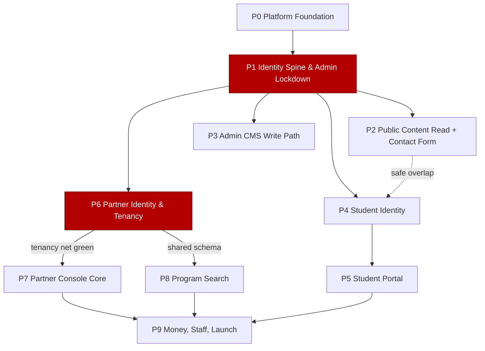
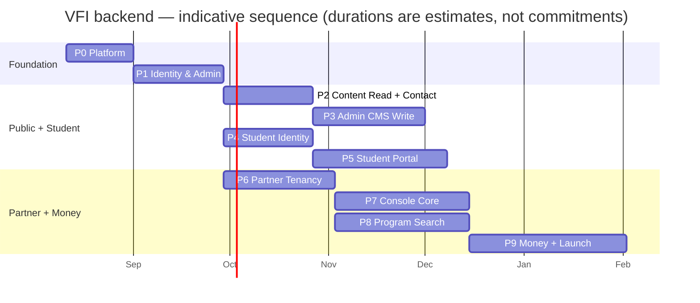

# Backend delivery phases — overview

**What this is:** the map of the 10-phase plan that takes VFI from a browser-only static demo to a production backend, and the rules for how a phase is declared done. **Who it's for:** engineers and AI agents building or reviewing the backend, and the two sign-off parties.

Read [memory.md](../../memory.md) first for the frontend orientation (the 52 pages, the `js/store.js` seam, the ES5/no-build constraint). Read [BACKEND_DEVELOPMENT_PLAN.md](../BACKEND_DEVELOPMENT_PLAN.md) for the data-model and security-architecture detail these phase docs reference.

> **Stack note.** The accepted stack is **PHP 8.3 / Laravel / Filament v4 / managed PostgreSQL 16 / Sanctum cookie sessions / Cloudflare R2 / Redis + Horizon, same-origin behind one nginx.** Any NestJS/Prisma references in `memory.md` and older sections of the master plan are superseded — see the FINAL STACK DECISION ADR. The frontend contract (the `js/store.js` HTTP-client seam) is stack-agnostic and unchanged.

---

## Philosophy

| Principle | What it means in practice |
|---|---|
| **Every phase ends demonstrable** | The phase closes on something a non-technical stakeholder can be shown working against real staging infrastructure — not a green test suite alone. |
| **Every phase leaves a safe system** | No phase exposes a write endpoint that isn't already behind its auth/tenancy net. You can stop after any phase and deploy what exists. |
| **Security is embedded, never deferred** | Each phase carries its own auth / tenancy / audit / rate-limit / upload hardening. There is no terminal "security phase". The attack a phase prevents must fail in a negative test *that same phase*. |
| **Foundation before features** | Platform → identity → tenancy → read surfaces → write surfaces → money. Nothing is built on a dependency that doesn't exist yet. |
| **The frontend barely changes** | The 52 ES5 pages migrate behind the `js/store.js` HTTP-client seam and the `window.VFI_BOOTSTRAP` content bundle. The 11 `REAL REQUEST` markers plus two unmarked write paths (contact form, student document upload) are wired one flow at a time, behind Laravel Pennant flags, with the per-page demo disclaimer removed as each goes live. |

---

## Gate model

A phase is **DONE** only when all four hold:

1. **Every exit-gate criterion is demonstrably true in staging**, verified by re-running the phase's named tests green in CI.
2. **The phase's security work is proven by a negative test** — the attack it prevents actually fails.
3. **A live end-to-end demo** of the phase's demonstrable outcome is walked through against staging.
4. **No BLOCK-class CI gate is red.**

### CI gate classes

| Class | Gates | On failure |
|---|---|---|
| **BLOCK** | secrets scan (gitleaks), fixable Critical/High CVEs, SAST-high, the untenanted-query tenancy test, denied licenses | Merge/deploy blocked |
| **WARN** | style nits, low/medium CVEs with no fix, informational SAST | Logged, not blocking |

### Sign-off (two-party)

| Signer | Signs |
|---|---|
| Architecture / DevSecOps lead | The security work + exit-gate criteria |
| Client product owner | The demonstrable outcome |

### Hard gates (cannot be waived or carried as debt)

- **Phase 1** — admin authentication. No admin route or `admin.html` content reachable without an authenticated admin session.
- **Phase 6** — tenant isolation. A partner cannot read another agency's data via any client-supplied id; RLS returns zero rows if the app scope is removed.

### Standing gates (every phase from Phase 0)

- **Expand/contract migrations.** Any migration in release _N_ must be safe against _N-1_ code, so a code rollback is always DB-safe.
- **Promotion to production is a separate gated job** (DAST baseline current + backup-restore drill current), distinct from merge-to-main.

---

## Master phase table

| id | Title | Goal (one line) | Duration | Exit gate (one line) |
|---|---|---|---|---|
| [P0](phase-0-platform-and-delivery-foundation.md) | Platform & Delivery Foundation | Repo, envs, CI/CD, containers, empty managed DB — a signed health-checked build deploys to staging, zero features | 2–3 wk | Commit → signed image → blocks on injected secret/CVE → one-shot migrate → staging; static site same-origin with `/api/health` 200 |
| [P1](phase-1-identity-spine-and-admin-lockdown.md) | Identity Spine & Admin Lockdown **(P0)** | Build users/roles/sessions; close the top gap — admin has no auth — behind login + mandatory TOTP | 3–4 wk | No admin surface reachable unauthenticated (automated negative test); TOTP mandatory; CI tenancy test green; CSRF end-to-end |
| [P2](phase-2-public-content-read-path-storejs-seam-and-contact-form-persistence.md) | Public Content Read Path, store.js Seam & Contact-Form Persistence | Serve all 32 public pages from the API (read-only); stop silently dropping contact leads | 3–4 wk | 32 pages render with empty-means-fall-through intact; blog legacy-id URLs resolve; contact lead persists to a staff inbox |
| P3 | Admin CMS Write Path (Filament) | Real authenticated CMS: content CRUD + reorder, image pipeline, page toggles, safe backup, audit, role split | 4–5 wk | Staff CRUD all content with audit; stale whole-list save rejected; malicious upload/import rejected; `content_editor` cannot import/reset/toggle |
| P4 | Student Identity | Registration, sign-in, hardened OTP (flow_id), password reset incl. the missing reset landing page | 3–4 wk | Register → OTP (wrong codes rejected) → sign-in → reset end-to-end; no email in any URL; enumeration-safe; reset revokes all sessions |
| P5 | Student Portal | Real self-scoped profile, two document packs on scan-gated private storage, read-only tracking | 5–6 wk | Upload real files (virus-scanned, single-use signed GET); every read logged; no student id from client (IDOR test); portal renders nothing pre-auth |
| P6 | Partner Identity & Tenancy **(hard gate)** | The tenant: agency registration + review workflow + sign-in, and prove tenant isolation | 4–5 wk | Cross-tenant read impossible (negative test + RLS); email-change takeover fails; approval mints exactly one tenant |
| P7 | Partner Console Core | Tenant-scoped students, the applications pipeline + 8 KPIs, enquiries with document intake, QR attribution | 5–6 wk | Tenant-scoped console; KPIs server-computed; QR opaque/revocable + verify-before-attribution; console renders nothing pre-auth |
| P8 | Program Search | Postgres-first flat search over ~300–600k rows, 40 combinable facets, ingest pipeline | 4–6 wk | Free-text + any facet combo, paged/sorted, p95 < 400 ms at real row count; one served taxonomy; atomic ingest swap |
| P9 | Money, Staff Back-office & Launch | Wallet/ledger + PSP + fee debits + Flywire; staff authoring; GDPR/retention; production cutover | 5–7 wk | Webhook-only idempotent credit; atomic fee debit; append-only ledger; GDPR export/erasure/retention live; prod monitored + drilled |

**P0**-suffixed phases carry the two P0 emergencies (admin has no auth; the contact form discards real leads). **Bold "hard gate"** phases cannot ship with the gate waived.

---

## Sequence

---

## Parallelisation (2–4 devs)

Standing role split inside a phase:

| Role | Owns |
|---|---|
| **A — backend/API** | Laravel resources, migrations, policies, tenancy scopes |
| **B — Filament/admin** | The CMS panel and the staff back-office |
| **C — frontend-seam** | Wiring `js/store.js` accessors, removing per-page demo disclaimers |

These three rarely collide.

**Safe cross-phase overlaps**

- **P2 (content read) ∥ P4 (student identity)** once the P1 identity spine exists — disjoint tables and routes.
- **P8 (program search) ∥ P7 (console core)** by a dedicated dev once the taxonomy + institution/program migration lands. P8's real blocker is the undefined catalogue data source, not code.

**Hard serial edges — never parallelise across these**

| Edge | Reason |
|---|---|
| P0 → P1 | No product code before the platform exists |
| P1 admin-auth → P3 | No admin write endpoint may exist before admin auth |
| P6 tenancy net → P7 / P8 / P9 | No partner data endpoint before the tenancy net is green |

Reconciliation / ingest / AI features are Pennant-flag-gated so partial work merges dark without touching the demonstrable system.

---

## Using these documents day to day

- **Starting a phase:** read that phase doc top to bottom. Prerequisites list what must already be green. Work through the numbered breakdown; nothing outside the in-scope list ships in this phase.
- **The out-of-scope list is load-bearing.** If a task feels in-scope but is listed out, it belongs to a later phase — do not pull it forward.
- **Before opening a PR:** every item under the phase's Testing section has a corresponding automated test, and the security work has its negative test.
- **Closing a phase:** walk the EXIT GATE checkbox list. Each box is objectively verifiable — a passing named test, a demoed flow, or a rejected attack. Two-party sign-off, then promote via the separate production job.
- **Frontend wiring:** each phase names exactly which files and which `REAL REQUEST` markers it touches. Search `REAL REQUEST` in `js/auth.js`, `js/partner-auth.js`, `js/portal.js` to locate them. Remove a page's demo-disclaimer only after its flow is live.

Cross-links used throughout: [memory.md](../../memory.md) (frontend), [BACKEND_DEVELOPMENT_PLAN.md](../BACKEND_DEVELOPMENT_PLAN.md) (data model + security architecture).
